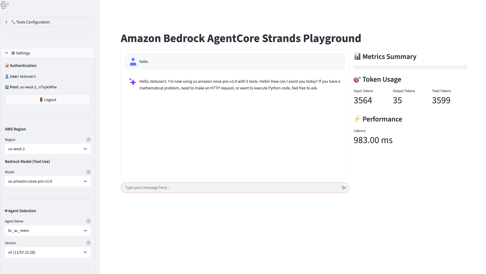
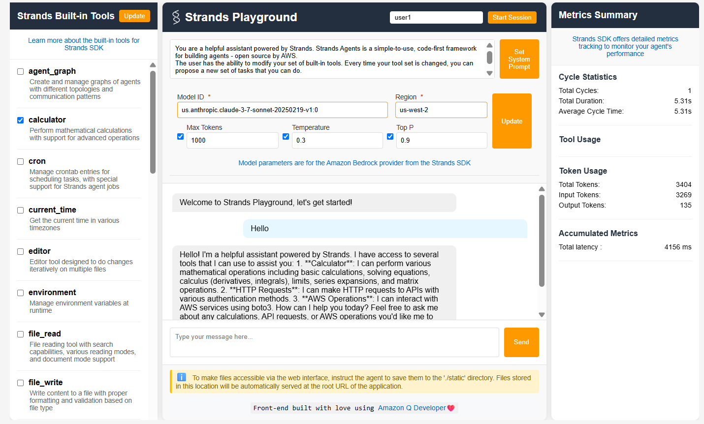
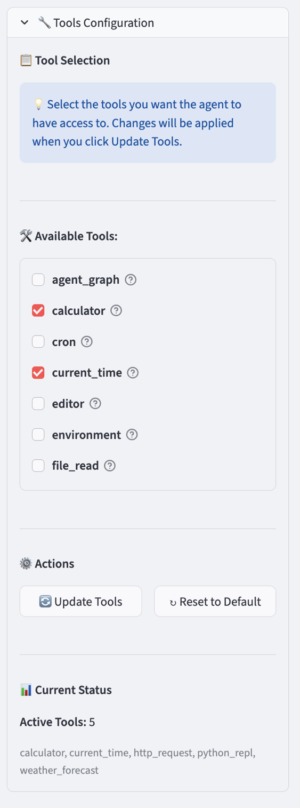
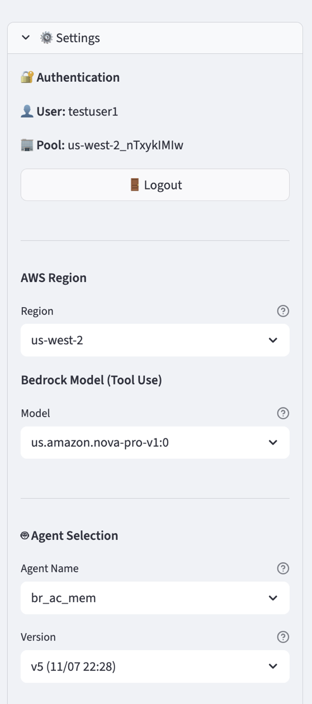
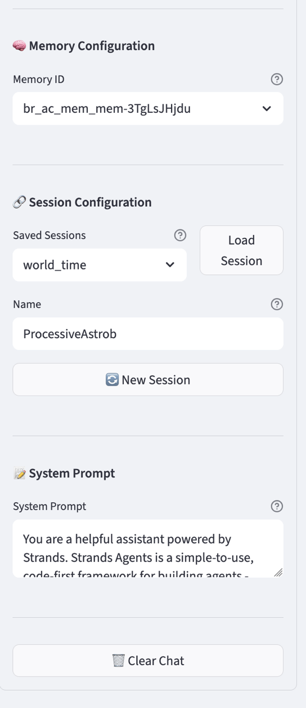
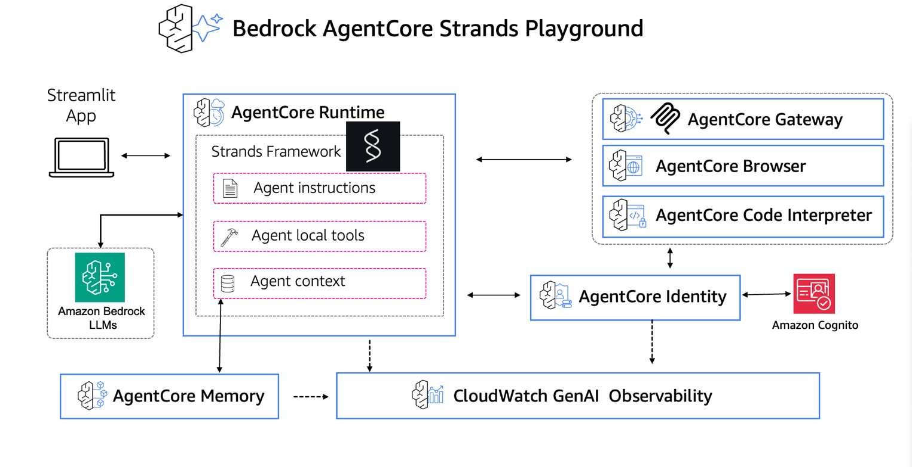
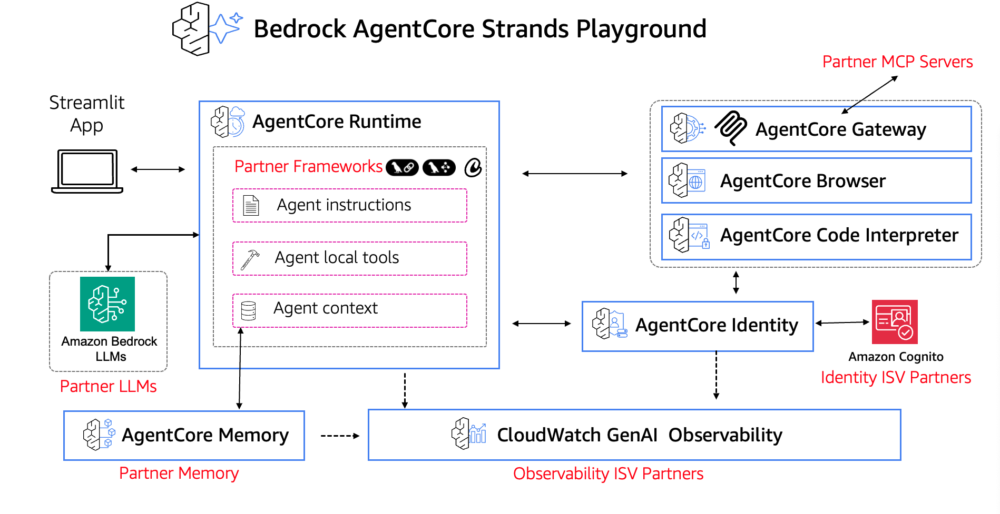

# Bedrock AgentCore Strands Playground

## Overview

Strands Playground is an example agent in the Strands SDK repo: https://github.com/strands-agents/samples/tree/main/04-UX-demos/05-strands-playground
The agent runs locally and uses a model hosted in Amazon Bedrock. I ported the agent to run in Bedrock AgentCore, and made several changes.

## Original Agent

The original agent ran locally, using a FastAPI-based API to implement a Strands agent. The agent used did not have authentication, and used local files or a DynamoDB database for memory.

## AgentCore Agent

The new version takes advantage of several AgentCore features. 1/ runs in AgentCore Runtime, a secure, isolated, dynamic execution environment. 2/ (optionally) uses AgentCore Identity to pass a JWT to the agent from the front-end. 3/ uses AgentCore Memory -- both short-term and long-term, to store user preferences and conversation history. 4/ uses AgentCore Observability to track token usage, latency, traces, and spans.

## Original Interface

## AgentCore Interface

## Extensions

|                                                  |                                                                                                                                                                                                                                                                                                                                             |
| -------------------------------------------------- | --------------------------------------------------------------------------------------------------------------------------------------------------------------------------------------------------------------------------------------------------------------------------------------------------------------------------------------------- |
|    | The Tool Selection interface remains the same as in the original agent.                                                                                                                                                                                                                                                                     |
|    | Running the agent in Bedrock AgentCore enables several extensions to the agent, which are managed in the Settings panel. Users can log into a Cognito pool; invocations of the agent running in AgentCore require a valid JWT. Users can select a region and Bedrock model. Users can select an agent and version from the region.          |
|  | Users can select a specific Bedrock AgentCore memory store, or use one configured via the AgentCore Starter Toolkit. Bedrock AgentCore memory gives the ability to store different sessions for the same user. Users can name sessions instead of referring to them by a UUID. Users can also change the System Prompt passed to the model. |

## Architecture

## Partner Integration Opportunities

