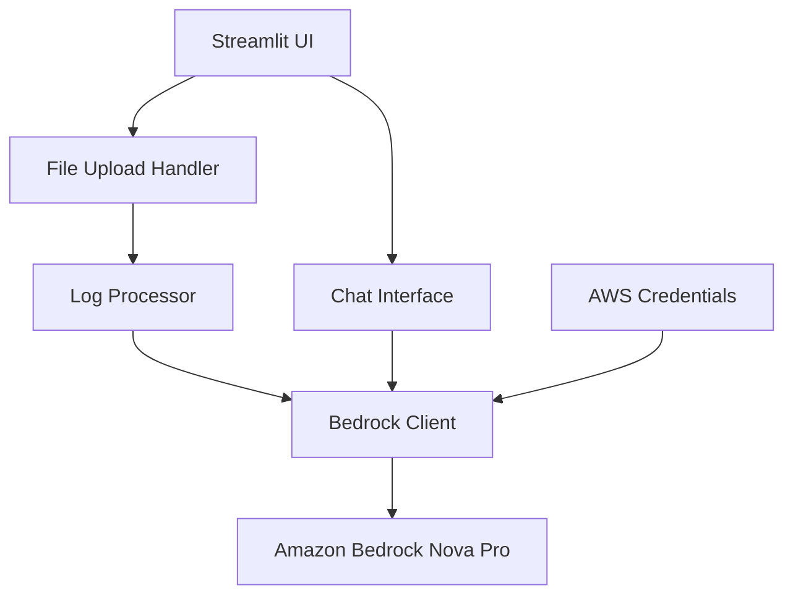

# Design Document

## Overview

The Streamlit Log Analyzer is a web application built using Python's Streamlit framework that provides an intuitive interface for log file analysis using Amazon Bedrock's Nova Pro model. The application follows a simple workflow: upload → analyze → chat, with automatic analysis triggering upon file upload and an interactive chat interface for follow-up questions.

## Architecture

The application uses a single-page Streamlit architecture with the following key components:



### Core Components:
- **Streamlit Frontend**: Handles UI rendering and user interactions
- **File Upload Handler**: Manages file upload validation and processing
- **Log Processor**: Prepares log content for analysis
- **Bedrock Client**: Manages AWS Bedrock API interactions
- **Chat Interface**: Handles conversational interactions with context

## Components and Interfaces

### 1. Main Application (`app.py`)
- **Purpose**: Entry point and UI orchestration
- **Key Functions**:
  - `main()`: Application entry point and layout setup
  - `render_upload_section()`: File upload UI component
  - `render_analysis_section()`: Analysis results display
  - `render_chat_section()`: Chat interface component

### 2. Bedrock Service (`bedrock_service.py`)
- **Purpose**: AWS Bedrock integration and API management
- **Key Functions**:
  - `BedrockService.__init__()`: Initialize AWS client with credentials
  - `analyze_logs(log_content: str) -> dict`: Send logs for analysis
  - `chat_with_logs(question: str, log_context: str, chat_history: list) -> str`: Handle chat interactions
  - `_format_analysis_prompt(log_content: str) -> str`: Format prompts for log analysis
  - `_format_chat_prompt(question: str, context: str, history: list) -> str`: Format prompts for chat

### 3. Log Processor (`log_processor.py`)
- **Purpose**: Log file handling and preprocessing
- **Key Functions**:
  - `validate_file(uploaded_file) -> bool`: Validate file format and size
  - `process_log_content(file_content: str) -> str`: Clean and prepare log content
  - `extract_log_summary(content: str) -> dict`: Extract basic log metadata

### 4. UI Components (`ui_components.py`)
- **Purpose**: Reusable UI elements and styling
- **Key Functions**:
  - `display_analysis_results(analysis: dict)`: Format and display analysis results
  - `display_chat_message(message: str, is_user: bool)`: Render chat messages
  - `show_loading_spinner(message: str)`: Display loading states

## Data Models

### Log Analysis Response
```python
@dataclass
class AnalysisResult:
    has_issues: bool
    issues: List[LogIssue]
    summary: str
    recommendations: List[str]
    confidence_score: float

@dataclass
class LogIssue:
    severity: str  # "critical", "warning", "info"
    description: str
    line_numbers: List[int]
    suggested_solution: str
```

### Chat Context
```python
@dataclass
class ChatMessage:
    content: str
    is_user: bool
    timestamp: datetime

@dataclass
class ChatContext:
    log_content: str
    analysis_result: AnalysisResult
    chat_history: List[ChatMessage]
```

## Error Handling

### AWS/Bedrock Errors
- **Connection Issues**: Display user-friendly messages with retry options
- **Authentication Failures**: Show credential setup instructions
- **Rate Limiting**: Implement exponential backoff with user notification
- **Model Errors**: Graceful degradation with error logging

### File Upload Errors
- **Invalid Format**: Clear error messages with supported format list
- **File Size Limits**: Display size restrictions and suggestions
- **Corrupted Files**: Handle parsing errors gracefully

### Application Errors
- **Session State**: Implement proper session management
- **Memory Management**: Handle large log files efficiently
- **UI State**: Maintain consistent UI state across interactions

## Testing Strategy

### Unit Tests
- **Bedrock Service**: Mock AWS calls, test prompt formatting
- **Log Processor**: Test file validation and content processing
- **UI Components**: Test component rendering and state management

### Integration Tests
- **End-to-End Flow**: Upload → Analysis → Chat workflow
- **AWS Integration**: Test with actual Bedrock service (dev environment)
- **Error Scenarios**: Test various failure modes and recovery

### Manual Testing
- **UI/UX**: User experience validation
- **Performance**: Large file handling and response times
- **Cross-browser**: Ensure compatibility across browsers

## Implementation Notes

### AWS Configuration
- Use boto3 with standard AWS credential chain (environment variables, AWS CLI, IAM roles)
- Support for custom endpoint configuration for different AWS regions
- Implement proper error handling for credential issues

### Streamlit Specific Considerations
- Use `st.session_state` for maintaining application state
- Implement proper file caching to avoid re-processing on reruns
- Use `st.spinner()` for loading states during API calls

### Security Considerations
- Validate and sanitize all uploaded file content
- Implement file size limits to prevent resource exhaustion
- Ensure sensitive log data is not logged or cached inappropriately
- Use secure AWS credential handling practices

### Performance Optimizations
- Implement file content caching using Streamlit's caching mechanisms
- Chunk large log files for processing if needed
- Use asynchronous processing where possible for better user experience