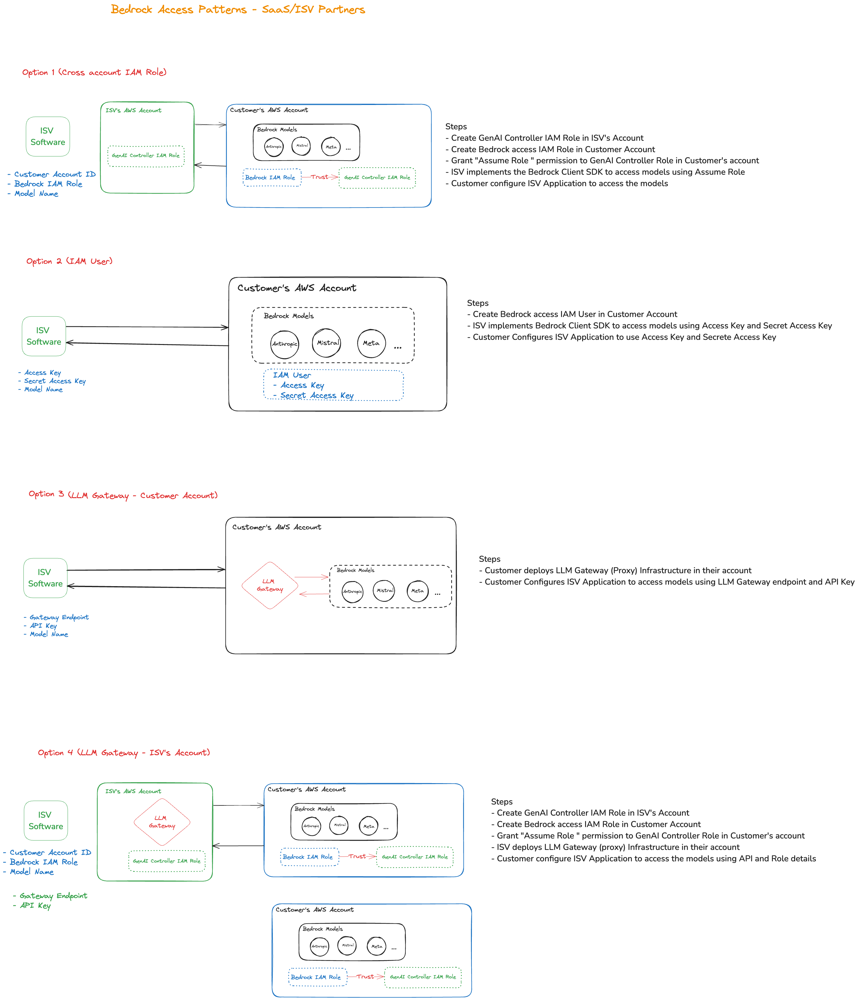

# Bedrock Access Patterns

This project demonstrates various ways to access Bedrock models from your application.

## Architecture


## Prerequisites

To use the "Customer LLM Gateway" or "ISV LLM Gateway" integration options, you must first deploy the `bedrock-access-gateway` from the following repository:

https://github.com/aws-samples/bedrock-access-gateway

Follow the instructions in the repository to deploy the `bedrock-access-gateway` in your AWS account. After the deployment is complete, you can use the generated API endpoint and API key in the configuration settings for this project.

To use Cross Account Role options follow these steps in the customer account

Set up the necessary IAM role with following policy and trust relationship for the "Cross Account Role" integration option:

Policy:

```json
{
  "Version": "2012-10-17",
  "Statement": [
    {
      "Sid": "VisualEditor0",
      "Effect": "Allow",
      "Action": [
        "bedrock:*",
        "s3:*"
      ],
      "Resource": [
        "*",
        "arn:aws:s3:::<BUCKET_NAME>"
      ]
    }
  ]
}
```

- Replace `<BUCKET_NAME>` with the name of the S3 bucket where you want to store Bedrock logs (if applicable).

Trust relationship:

   ```json
   {
     "Version": "2012-10-17",
     "Statement": [
       {
         "Sid": "Statement1",
         "Effect": "Allow",
         "Principal": {
           "AWS": "arn:aws:sts::<ISV_ACCOUNT_ID>:assumed-role/<PRINCIPAL_ROLE_NAME>"
         },
         "Action": "sts:AssumeRole",
         "Condition": {
           "StringEquals": {
             "sts:ExternalId": "<EXTERNAL_ID>"
           }
         }
       }
     ]
   }
```
- Replace `<ISV_ACCOUNT_ID>` with your AWS account ID of ISV.

- Replace `<PRINCIPAL_ROLE_NAME>` with the name of the role that will assume the Bedrock IAM role.

- Replace `<EXTERNAL_ID>` with the external ID you set in the config.local.yaml file.


## Setup

1. Clone the repository or download the source code.
2. Copy the `config.yaml` file to a new file named `config.local.yaml`.
3. Update the configuration values in `config.local.yaml` with your own settings. Here's an explanation of each value:
   - `access_key`: Your AWS access key (required for IAM User integration option).
   - `secret_access_key`: Your AWS secret access key (required for IAM User integration option).
   - `bedrock_iam_role`: The Bedrock IAM role name (required for Cross Account Role and ISV LLM Gateway integration options).
   - `customer_account_id`: Your AWS account ID (required for Cross Account Role and ISV LLM Gateway integration options).
   - `external_id`: The external ID for the Bedrock IAM role (required for Cross Account Role and ISV LLM Gateway integration options).
   - `selected_model`: The initial model to use (e.g., "anthropic.claude-3-sonnet-20240229-v1:0").
   - `api_endpoint`: The API endpoint for the Customer LLM Gateway integration option.
   - `api_key`: The API key for the Customer LLM Gateway integration option.

4. Make sure to replace the placeholders in `config.local.yaml` with your actual values.
5. **Important:** Do not commit the `config.local.yaml` file to version control (e.g., Git) as it may contain sensitive information.
6. You can install these dependencies by running:
`pip install -r requirements.txt`

## Running the Application

To run the application, execute the following comman

`mesop app.py`

## Using Local/OpenAI API compatible Models

This project supports using Local/OpenAI API compatible Models. To use a local model, follow these steps:

1. Install and set up Ollama or similar on your local machine.
2. Deploy your desired model.
3. (optional for default endpoint when you load the app) In the `config.local.yaml` file, set `selected_option` to `"Customer LLM Gateway"`.
4. Set `api_endpoint` to `http://localhost:11434/v1` for local model
5. You can leave the `api_key` value empty for local models.

## Contributing
If you'd like to contribute to this project, please follow these steps:

1. Fork the repository
2. Make your changes
3. Commit your changes and push to your fork
4. Create a pull request

Please make sure to update the config.yaml file with any new configuration values needed for your changes. modifications in the config.local.yaml file, will remain untracked for each user's local configuration.


