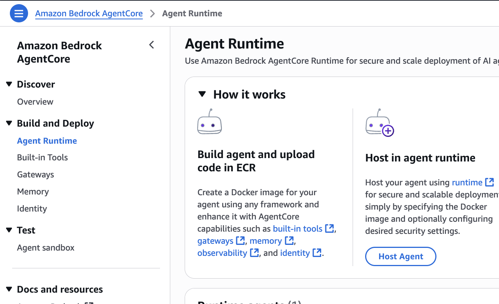
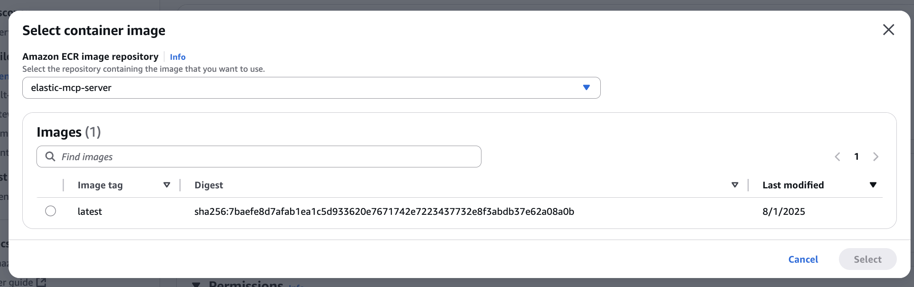
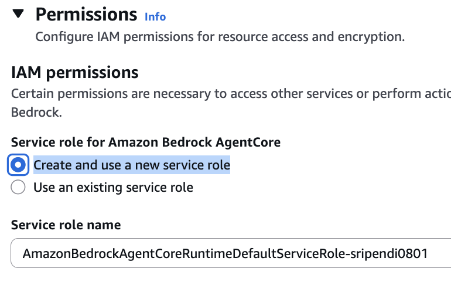
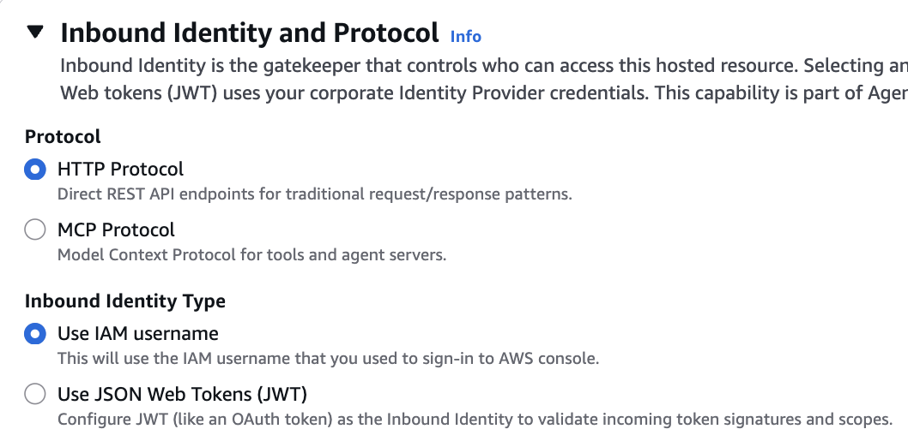
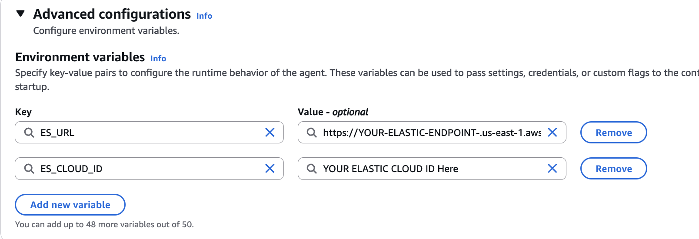
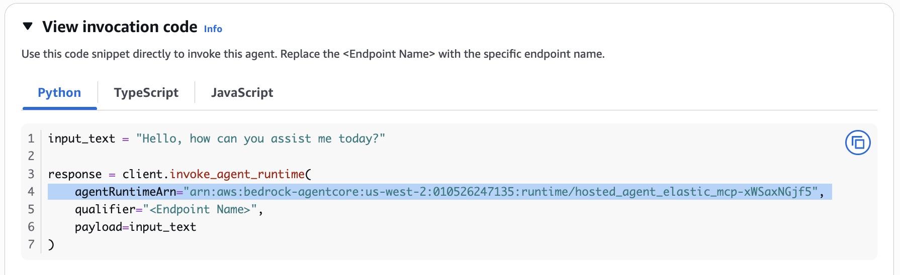

# Elastic MCP Server on Amazon Bedrock AgentCore Runtime

## About Amazon Bedrock AgentCore Runtime

Amazon Bedrock AgentCore Runtime is a secure, serverless runtime designed for deploying and scaling AI agents and tools in production environments. It supports any frameworks, models, and protocols, enabling developers to transform local prototypes into production-ready solutions with minimal code changes. AgentCore provides session isolation, automatic scaling, and seamless integration with AWS services, making it ideal for hosting containerized AI tools like MCP servers. The runtime handles HTTP server details, authentication, and infrastructure management, allowing developers to focus on their agent's core functionality while ensuring enterprise-grade security and reliability.

This project demonstrates how to deploy and interact with Elastic's Model Context Protocol (MCP) server on Amazon Bedrock AgentCore Runtime. The implementation showcases how to transform local MCP prototypes into production-ready solutions with minimal code changes.

## 🏗️ Architecture Overview

```
Python Client → AWS Auth → Bedrock AgentCore → MCP Server → Elasticsearch → Results
```

The solution consists of:
- **Elastic MCP Server**: Containerized Rust-based server providing Elasticsearch search capabilities
- **Amazon Bedrock AgentCore Runtime**: Secure, serverless runtime for hosting AI agents and tools
- **Python Client**: Demonstrates interaction with the hosted MCP server using HTTP and Boto3 approaches

## 📋 Prerequisites

### AWS Requirements
- AWS Account with appropriate permissions
- AWS CLI configured with credentials
- Access to Amazon Bedrock AgentCore service
- Amazon ECR repository access

#### AWS Account Setup
- Active AWS account with access to Amazon Bedrock 
- AWS CLI installed and configured 
- Permissions to use Claude 3 Sonnet model
- Set up AWS credentials for Bedrock access:

```shell
# Set environment variables (temporary)
export AWS_ACCESS_KEY_ID=your_access_key_id
export AWS_SECRET_ACCESS_KEY=your_secret_access_key
export AWS_REGION=us-west-2

# Or configure AWS CLI (permanent)
aws configure
```

### Local Development Environment
- **Python 3.8+** with pip
- **Docker** installed and running
- **Git** for cloning repositories
- **AWS CLI** configured with proper credentials

### Required AWS Permissions
Your AWS credentials need the following permissions:
```json
{
    "Version": "2012-10-17",
    "Statement": [
        {
            "Effect": "Allow",
            "Action": [
                "ecr:*",
                "bedrock-agentcore:*",
                "sts:GetCallerIdentity"
            ],
            "Resource": "*"
        }
    ]
}
```

## 🚀 Quick Start

### Step 1: Deploy Elastic MCP Server to ECR

Run the automated deployment script to download, build, and upload the Elastic MCP server:

```bash
./deploy-elastic-mcp.sh
```

This script will:
1. Clone the [Elastic MCP server repository](https://github.com/elastic/mcp-server-elasticsearch)
2. Build the Docker container using `Dockerfile-8000`
3. Create an ECR repository named `elastic-mcp-server`
4. Push the container image to ECR

**Expected Output:**
```
🎉 Deployment completed successfully!
📍 ECR Repository URI: 010526247135.dkr.ecr.us-west-2.amazonaws.com/elastic-mcp-server
🏷️ Image Tag: latest
```

### Step 2: Create AgentCore Runtime Host

1. Navigate to **Amazon Bedrock AgentCore** in the AWS Console
2. Click on **Agent Runtime** → **Host Agent**



3. Configure the host agent:
   - **Name**: `hosted_agent_elastic_mcp`
   - **Container Image**: Use the ECR URI from Step 1
   
   

4. **Service Role**: Choose "Create and use a new service role"
   
   

5. **Protocol Settings**:
   - **Protocol**: MCP protocol
   - **Inbound Identity**: Use IAM username
   
   

6. **Environment Variables**: Configure Elasticsearch endpoints
   
   

7. Click **Host agent** to create the runtime

8. **Copy the Agent Runtime ARN** from the "View invocation code" section:
   
   

   Example ARN:
   ```
   arn:aws:bedrock-agentcore:us-west-2:010526247135:runtime/hosted_agent_elastic_mcp-xWSaxNGjf5
   ```

### Step 3: Configure and Run the Python Client

1. **Update the Agent ARN** in `my_mcp_client_remote.py`:
   ```python
   agent_arn = "arn:aws:bedrock-agentcore:us-west-2:010526247135:runtime/hosted_agent_elastic_mcp-xWSaxNGjf5"
   ```

2. **Set up Python environment**:
   ```bash
   python3 -m venv venv
   source venv/bin/activate  # On Windows: venv\Scripts\activate
   pip install -r requirements.txt
   ```

3. **Run the client**:
   ```bash
   python my_mcp_client_remote.py
   ```

## 📊 Expected Output

When successfully executed, you should see output similar to:

```
=== Testing MCP Endpoint ===

--- Testing tools/list (ID: 1) ---
Request: {
  "jsonrpc": "2.0",
  "method": "tools/list",
  "id": 1
}

--- Testing tools/call (ID: 2) ---
Request: {
  "jsonrpc": "2.0",
  "id": 2,
  "method": "tools/call",
  "params": {
    "name": "search",
    "arguments": {
      "index": "events",
      "query_body": {
        "query": {
          "match": {
            "name": "paris"
          }
        },
        "size": 5
      }
    }
  }
}

=== Chat with AgentCore (HTTP) ===

--- Chat Query: Events in Paris ---
Status: 200
Response: data: {"jsonrpc":"2.0","id":3,"result":{"content":[...]}}

🎉 I found 1 events in Paris:

1. Paris Fashion Week
   📍 Murray-Howell Theater - 17814 Mills Mountains Apt. 815, Poncetown, DE 29241
   📅 2026-04-02
   📝 Major fashion event showcasing the latest collections from top designers.
   💰 $$$
   🎫 https://tickets.reed.net/event/DEST0001_EVT002
```

## 🔧 Code Structure

### Core Components

#### `my_mcp_client_remote.py`
The main client script with three key functions:

1. **`AWSAuth` Class**: Handles AWS Signature V4 authentication
2. **`test_mcp_endpoint()`**: Tests basic MCP protocol methods (`tools/list`, `tools/call`)
3. **`chat_with_agentcore()`**: Demonstrates conversational interaction with formatted output
4. **`chat_with_agentcore_boto3()`**: Alternative Boto3 approach (currently returns 406 errors)

#### `deploy-elastic-mcp.sh`
Automated deployment script that:
- Downloads the Elastic MCP server repository
- Builds Docker container using `Dockerfile-8000`
- Creates ECR repository with image scanning enabled
- Pushes container to ECR with proper tagging

#### `requirements.txt`
Python dependencies:
```
mcp                              # Model Context Protocol library
boto3                           # AWS SDK for Python
bedrock-agentcore              # Bedrock AgentCore SDK
bedrock_agentcore_starter_toolkit  # AgentCore utilities
httpx                          # Async HTTP client
```

## 🔄 Data Flow

1. **Authentication**: Python client generates AWS SigV4 headers
2. **Request**: Sends JSON-RPC 2.0 formatted requests to AgentCore
3. **Routing**: AgentCore forwards requests to the hosted MCP server
4. **Processing**: MCP server queries Elasticsearch using the provided parameters
5. **Response**: Results flow back through the chain as Server-Sent Events (SSE)
6. **Formatting**: Client parses and displays results in user-friendly format

### Data Loading
1. Go to 'aws-generativeai-partner-samples/elastic/mcp/official-elastic-mcp-server-demo/data' directory. Generate destination and travel data. The first 2 commands will generate data locally and you can view how the sample data looks like and next commnads will laod the data in Elastic search index:
   ```
   python generate_data.py --save-json
   ```

2. Generate user profiles and reservations:
   ```
   python generate_user_data.py --save-json
   ```

3. Load all data into Elasticsearch:
   ```
   python generate_data.py --load-es
   python generate_user_data.py --load-es
   ```

## 🛠️ Key Features

### MCP Protocol Compliance
- **JSON-RPC 2.0** format for all communications
- **Stateless operation** with session isolation via `Mcp-Session-Id` headers
- **Server-Sent Events (SSE)** support for streaming responses
- **Tool discovery** via `tools/list` method
- **Tool execution** via `tools/call` method

### Elasticsearch Integration
- **Index querying** with flexible search parameters
- **Boolean queries** across multiple fields (name, description, venue, address)
- **Structured results** with event metadata (dates, prices, locations, booking URLs)
- **Pagination support** with configurable result sizes

### AWS Integration
- **Bedrock AgentCore Runtime** for serverless hosting
- **ECR integration** for container management
- **IAM authentication** with SigV4 signing
- **Session management** with automatic header injection

## 🔍 Troubleshooting

### Common Issues

1. **Authentication Errors (403)**:
   - Verify AWS credentials are configured: `aws sts get-caller-identity`
   - Check IAM permissions for Bedrock AgentCore access
   - Ensure the agent ARN is correct

2. **Container Build Failures**:
   - Verify Docker is running: `docker --version`
   - Check ECR permissions: `aws ecr describe-repositories`
   - Ensure sufficient disk space for Docker builds

3. **Agent Runtime Not Found (404)**:
   - Verify the agent ARN in `my_mcp_client_remote.py`
   - Check that the AgentCore host is in "Running" state
   - Ensure you're using the correct AWS region

4. **Connection Timeouts**:
   - Check network connectivity to AWS services
   - Verify security group settings if running in VPC
   - Increase timeout values in the HTTP client

### Debug Mode

Enable verbose logging by modifying the client:

```python
import logging
logging.basicConfig(level=logging.DEBUG)
```

## 📚 Additional Resources

- [Amazon Bedrock AgentCore Documentation](https://docs.aws.amazon.com/bedrock-agentcore/latest/devguide/what-is-bedrock-agentcore.html)
- [Model Context Protocol Specification](https://modelcontextprotocol.io/)
- [Elastic MCP Server Repository](https://github.com/elastic/mcp-server-elasticsearch)
- [AWS CLI Configuration Guide](https://docs.aws.amazon.com/cli/latest/userguide/cli-configure-files.html)

## 🤝 Contributing

1. Fork the repository
2. Create a feature branch: `git checkout -b feature-name`
3. Make your changes and test thoroughly
4. Submit a pull request with detailed description

## 📄 License

This project is licensed under the MIT License - see the LICENSE file for details.

## 🆘 Support

For issues and questions:
1. Check the troubleshooting section above
2. Review AWS CloudWatch logs for the AgentCore runtime
3. Examine Docker container logs during build process
4. Open an issue in this repository with detailed error information
