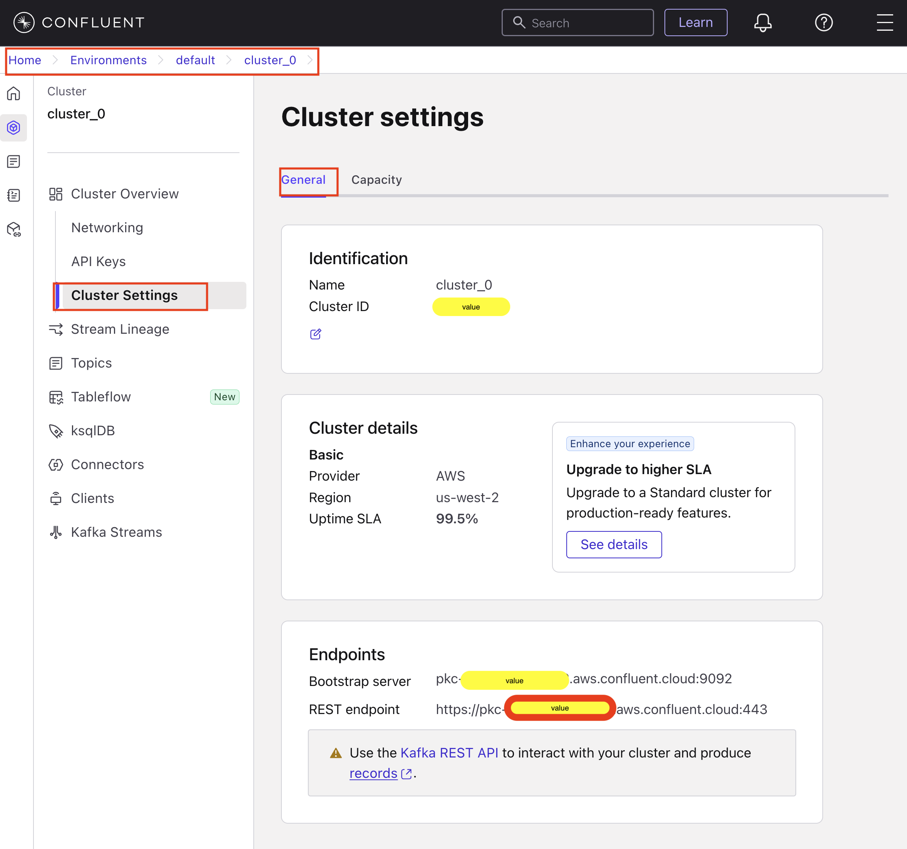
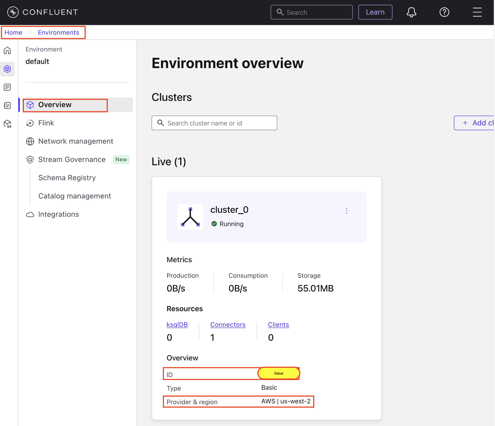
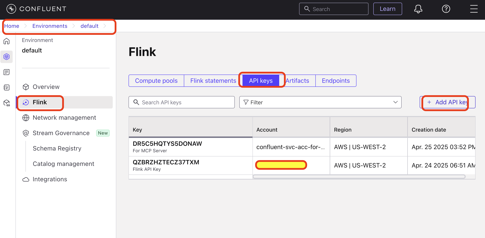
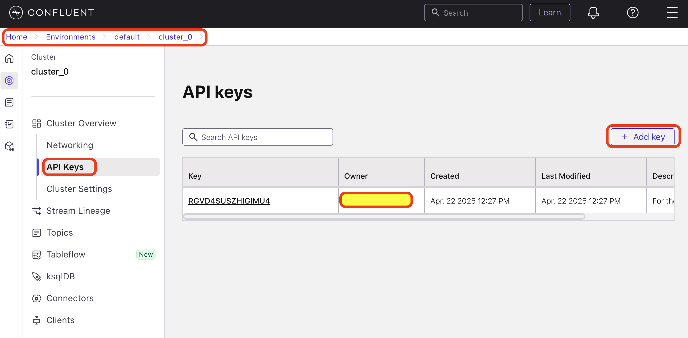
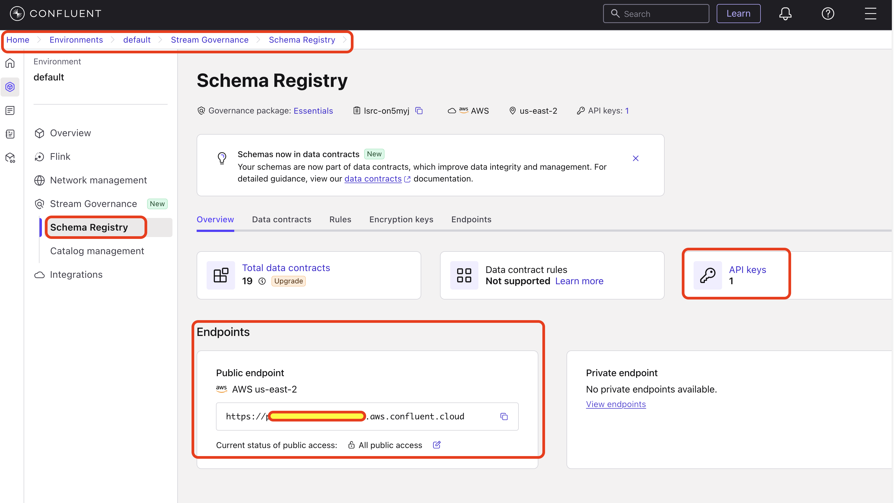

# Confluent Kafka Cluster Configurations Setup

After you setup Kafka cluster, you need to update the `.env` file with Kafka cluster configurations. This document outlines on how to find these details for your Kafka cluster. The screenshots may vary at the time of configuring your specific Kafka cluster but still server as a good directional instructions for the setup.

## Login into Confluent Cloud.
Go ahead and log in using your credentials at https://login.confluent.io/

## How to configure Kafka Cluster Settings

### Bootstrap server, Kafka Rest endpoints and Cluster ID
Navigate to : `Home --> Environments --> default --> {your_cluster}`
On the Left Hand Side (L.H.S) Navigation Bar, Click on `Cluster Overview --> Cluster Settings`
Click on the `General` tab
Under `Endpoints` section you will find the following details.
- Bootstrap server : use this to setup `BOOTSTRAP_SERVERS`
- REST endpoint : use this to setup `KAFKA_REST_ENDPOINT` & `CONFLUENT_CLOUD_REST_ENDPOINT`
- Cluster ID : use this to setup `KAFKA_CLUSTER_ID`

### Kafka environment id
Navigate to : `Home --> Environments --> default`
On the Left Hand Side (L.H.S) Navigation Bar, Click on `Overview`
In the `Environment overview` screen you will find the following details.
- ID : This is your environment ID. Use it to configure `KAFKA_ENV_ID` & `FLINK_ENV_ID`
- Provider & region: You will find the region details here. Use it to configure `FLINK_REST_ENDPOINT`. Usually the value is : `https://flink.{region}.aws.confluent.cloud`

### Flink configurations
Navigate to : `Home --> Environments --> default`
On the Left Hand Side (L.H.S) Navigation Bar, Click on `Flink`
In the `Flink --> Compute pools` tab, you will find:
- ID : Use this to configure `FLINK_COMPUTE_POOL_ID`

### API Keys
Navigate to : `Home --> Environments --> default`
On the Left Hand Side (L.H.S) Navigation Bar, Click on `Flink`
In the `Flink --> API keys` tab, you can create API Keys for Flink service by clicking on `+ Add API Keys`

- you have an option to create API Key for a user account ("My account") or for a "Service account". 
- choose API keys for user account and download the key.

Use this API key to configure:
- `FLINK_API_KEY` and `FLINK_API_SECRET`

Similarly, add API keys for Confluent cluster by navigating to `Home --> Environments --> default`
On the Left Hand Side (L.H.S) Navigation Bar, Click on `Cluster Overview --> API Keys`

Add the API key and use this to configure:
- `KAFKA_API_KEY` , `KAFKA_API_SECRET`
- `CONFLUENT_CLOUD_API_KEY` , `CONFLUENT_CLOUD_API_SECRET`

Following similar steps, generate SCHEMA registry API keys. To do this:
- navigate to : `Home --> Environments --> default --> {your_cluster}`.
- at the very bottom on the L.H.S Navigation Bar, click on `Schema Registry` & `Overview` tab
- in the `endpoints` section, you will get public endpoint for schema registry.
- use this to configure `SCHEMA_REGISTRY_ENDPOINT`
- Click on `API Keys` and create an API Key.
- Use this API key to configure: `SCHEMA_REGISTRY_API_KEY` & `SCHEMA_REGISTRY_API_SECRET`

### Organization ID
To access organization ID, click on the top Right Hand Side (R.H.S) menu, to access `Organization Settings`.

Get the Organization ID from this screen and configure: `FLINK_ORG_ID`

### Misc settings.
If you have not mangled much just leave the following values as `default` :
- `FLINK_ENV_NAME="default"`
- `FLINK_DATABASE_NAME="default"`
