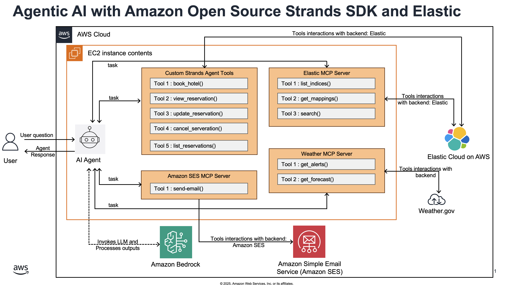

# Amazon Bedrock with Elastic - Agentic workflows with official Elastic MCP Server Demo

## Travel & Tourism Advisory application powered by Amazon Bedrock and Elastic MCP Server

This project implements a travel advisory application that uses MCP (Model Context Protocol) servers to integrate with Elasticsearch and weather services. The application leverages Amazon's Open Source [Strands SDK](https://github.com/strands-agents/sdk-python), to orchestrate an Agentic workflow that leverages tools from MCP servers and custom Strands Agent tools. The application provides information about tourist destinations, attractions, hotels, travel advisories, weather forecasts, and events. It also supports user profiles and hotel reservations.

## Product Demo

https://github.com/user-attachments/assets/d07149b9-5bdf-48e0-97da-b99ec521d3e3

## Overview 

The application provides intelligent analysis and information about tourist destinations, attractions, hotel etc and provides advisory to plan a travel, leverating: 
- Amazon's opensource [Strands SDK](https://github.com/strands-agents/sdk-python) based Agentic AI application
- Amazon Bedrock's Claude 3.x Sonnet for natural language understanding and reasoning 
- Elasticsearch's official MCP server for efficient data querying and analytics 
- Custom Weather MCP server for real-time weather data 
- Multi-server architecture for scalable and modular functionality 

## Reference Architecture



### Key Features 
- Natural language queries for complex travel advisory, recommendations and reservations 
- Search for destinations based on various criteria (continent, budget, safety, etc.)
- Find attractions at destinations
- Search for hotels with specific amenities
- Get travel advisories for countries
- Check weather forecasts for destinations
- Find events happening at destinations
- User profiles with preferences and loyalty information
- Hotel reservation management
- Room availability checking and booking

### Elasticsearch Indices

The application uses the following Elasticsearch indices:

1. **destinations**: Information about travel destinations
2. **attractions**: Tourist attractions at destinations
3. **hotels**: Hotel and accommodation information
4. **advisories**: Travel advisories and safety information
5. **weather**: Weather forecasts for destinations
6. **events**: Events happening at destinations
7. **users**: User profiles and preferences
8. **reservations**: Hotel reservation information
9. **room_availability**: Room availability and pricing information

### Real-World Data Integration

The application now uses realistic data for destinations and their related entities:

- Real-world destinations with accurate geographic information
- Famous attractions for popular cities
- Well-known hotels with appropriate amenities and star ratings
- Actual events that occur in each destination
- Realistic travel advisories based on current global conditions
- Seasonal weather patterns that match the destination's climate

This makes the data more coherent and realistic, providing a better demonstration of the travel advisory application's capabilities.

## Setup

### Spin up EC2
You can run this on your local machine, but the instructions here are for an EC2 machine with:
- Amazon Linux 2023 AMI
- 64-bit (x86)
- t2.medium
- 40GB gp3 storage

After you launch EC2 machine,  install git and clone this repo.

```bash
sudo yum install git -y
sudo yum install nodejs -y

git clone https://github.com/aws-samples/aws-generativeai-partner-samples.git
cd aws-generativeai-partner-samples/elastic/mcp/official-elastic-mcp-server-demo
```

### AWS Account Setup
- Active AWS account with access to Amazon Bedrock 
- AWS CLI installed and configured 
- Permissions to use Claude 3 Sonnet model
- Set up AWS credentials for Bedrock access:

```shell
# Set environment variables (temporary)
export AWS_ACCESS_KEY_ID=your_access_key_id
export AWS_SECRET_ACCESS_KEY=your_secret_access_key
export AWS_REGION=us-east-1

# Or configure AWS CLI (permanent)
aws configure
```

### Install Dependencies
If you are not running Python3.10+, here is how you can upgrade for Amazon Linux as an example:

```bash
sudo dnf upgrade --releasever=2023.7.20250331
# Search for python3.XX versions. 
sudo yum list available | grep python3

# if Python 3.10 or 3.11 is found, simply install.
sudo yum install python3.11 -y
python3.11 --version
sudo alternatives --install /usr/bin/python3 python3 /usr/bin/python3.11 1
sudo alternatives --config python3
python3 --version
```

### Elasticsearch Setup

Setup Elastic Cloud on AWS using the free trial [here](https://cloud.elastic.co/registration?fromURI=%2Fhome).
Note the following details to connect to Elastic Cloud from your application.

- Elasticsearch deployment (cloud or local)
- Elasticsearch API key
- In the next step (not now) you will create .env file. Please make a note of the following credentials that you will use in the next step :
```    
        ES_URL=your-elasticsearch-url 
        ES_API_KEY=your-api-key
```

### Set Up Python Environment & install Python dependencies

```bash
# install uv
cd aws-generativeai-partner-samples/elastic/mcp/official-elastic-mcp-server-demo
curl -LsSf https://astral.sh/uv/install.sh | sh

# Create a new environment
uv venv elastic-mcp-official-env

# Activate the environment
source elastic-mcp-official-env/bin/activate  # On Unix/Mac
# or
.\elastic-mcp-official-env\Scripts\activate   # On Windows

# Install required packages
uv pip install -r requirements.txt
```

### Set Up Environment Variables

Run the script `environment_variables_setup.sh` to setup `.env` file with the following credentials:
- Confluent Cloud credentials
- Elasticsearch credentials
- AWS credentials (for Bedrock access)

Make the script executable by adding execute permissions:
```
chmod +x environment_variables_setup.sh
./environment_variables_setup.sh
```
### Setup MCP Servers
There are 3 MCP servers needed for this app.
- Official MCP Server from Elastic: There are no additional steps needed to configure and run this. During runtime of this application, the MCP server is automatically downloaded and run.
- Weather MCP Server: Again, no additional steps needed. Its already pre-packaged in the `mcp-servers\weather` folder. While setting up the environment variables using the `environment_variables_setup.sh` script, give the absolute path to the `mcp-servers\weather\weather.py` script.
- Amazon SES MCP Server: In the `mcp-servers\aws-ses-mcp` folder, you have all the bits to run the MCP server. However it requires following configurations:

```
cd mcp-servers/aws-ses-mcp/
npm install
npm run build
```


### Data Loading
1. Generate destination and travel data:
   ```
   python generate_data.py --save-json
   ```

2. Generate user profiles and reservations:
   ```
   python generate_user_data.py --save-json
   ```

3. Load all data into Elasticsearch:
   ```
   python generate_data.py --load-es
   python generate_user_data.py --load-es
   ```

## Running the Application
Go ahead and run the application. You are supplying the weather MCP server path as an argument. There is no need to run Elasticsearch MCP server locally as you are directly using the official MCP server.

```bash
cd mcp-clients
python multi_server_client_travel_analytics.py ../mcp-servers/weather/weather.py
```

#### Sample Queries to ask

- I am planing a trip to New York in 2 weeks. Whats the weather like and are there any travel advisories?
- Which destinations in France, can I consider to visit? 
- OK, are there any upcoming events in France that are interesting to consider for my travel?
- Any interesting events in Paris around next year.
- Can you give precise details of when is Paris Fashion Week happening?
- Find me some hotels in Paris that offer free breakfast
- When are the rooms available for the Hôtel de Crillon (Rosewood) in Paris
- book hotel at Hôtel de Crillon (Rosewood) for 2 adults during the Paris Fashion Show week. I prefer a Deluxe room and a special request of 2 additional water bottles every day
- View all of my reservations
- update reservation replace_this_string_with_reservation_id
- Send me a confirmation email with my reservation details

##  Data Model
The application uses the following Elasticsearch indices:

1. **destinations**: Information about travel destinations
2. **attractions**: Tourist attractions at destinations
3. **hotels**: Hotel and accommodation information
4. **advisories**: Travel advisories and safety information
5. **weather**: Weather forecasts for destinations
6. **events**: Events happening at destinations
7. **users**: User profiles and preferences
8. **reservations**: Hotel reservation information
9. **room_availability**: Room availability and pricing information

## Conclusion
This project demonstrates how to create MCP-compliant servers for data retrieval and integrate them with foundation models to provide seamless responses to complex queries that span multiple domains of information.

### Amazon Bedrock
- Powerful natural language understanding with FMs from Anthropic via Amazon Bedrock
- No ML infrastructure management required
- Pay-per-use pricing model
- Enhanced reasoning capabilities for complex queries

### Elastic MCP Server
- Official integration with Elasticsearch
- Optimized query performance
- Real-time data analytics
- Secure data access
- Advanced hybrid search capabilities.


## Cleanup and Data Management

The application now includes functionality to clean up Elasticsearch indices before loading new data:

### Cleaning Up All Indices

To delete all indices before loading new data:
```
python generate_data.py --cleanup --load-es
```

To only delete all indices without loading new data:
```
python generate_data.py --delete-indices
```

### Cleaning Up User-Related Indices

To delete only user-related indices before loading user data:
```
python generate_user_data.py --cleanup --load-es
```

To only delete user-related indices without loading new data:
```
python generate_user_data.py --delete-indices
```
