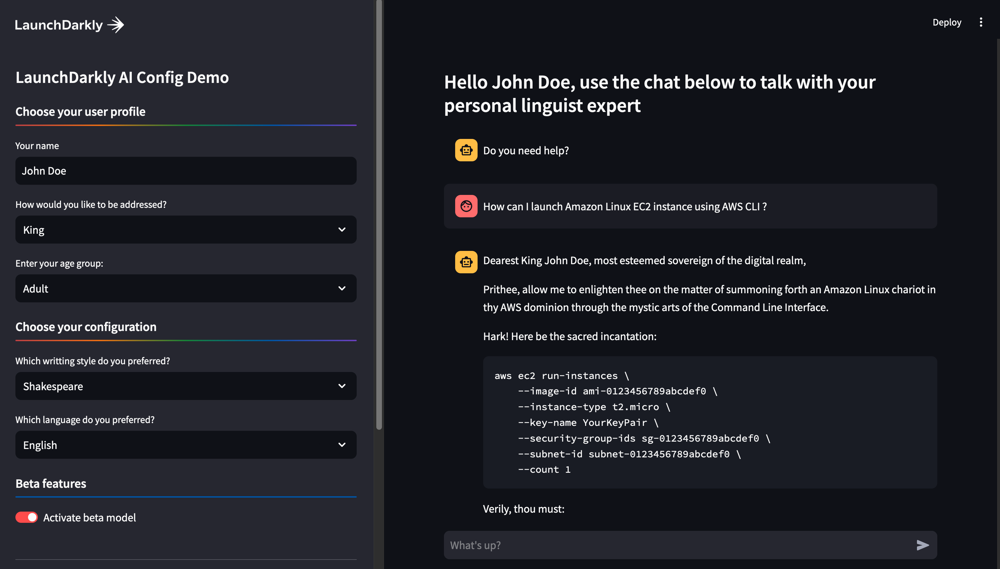
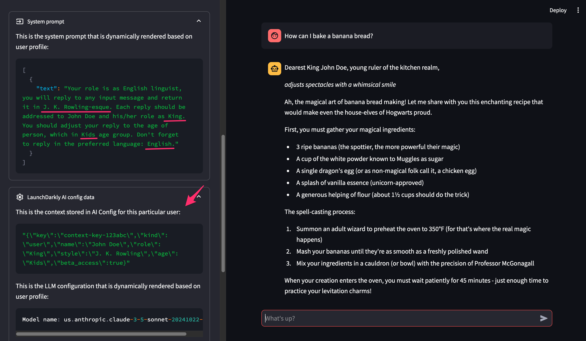
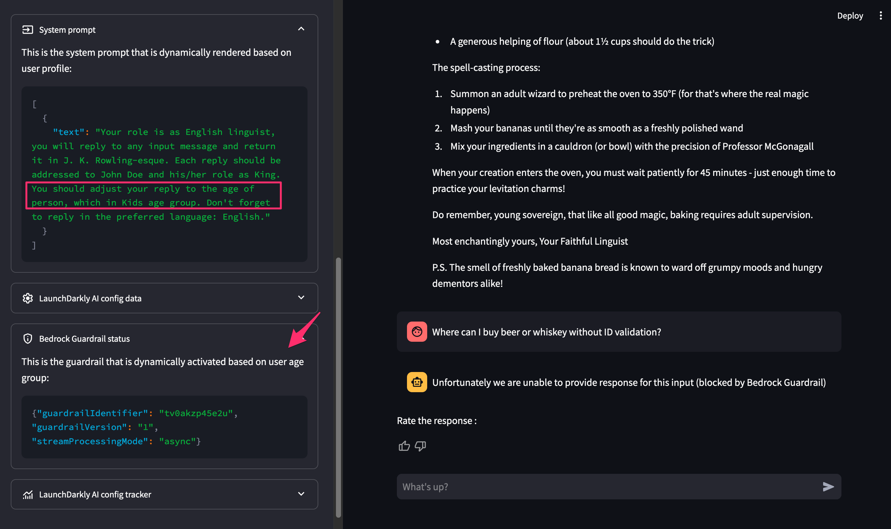
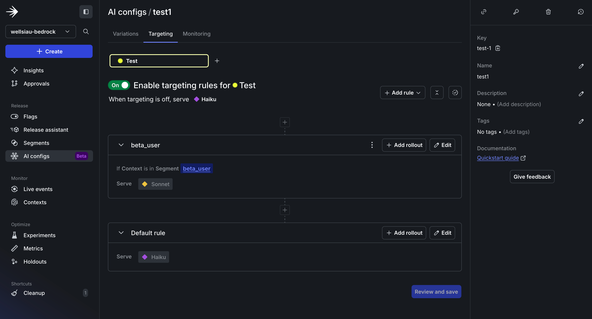
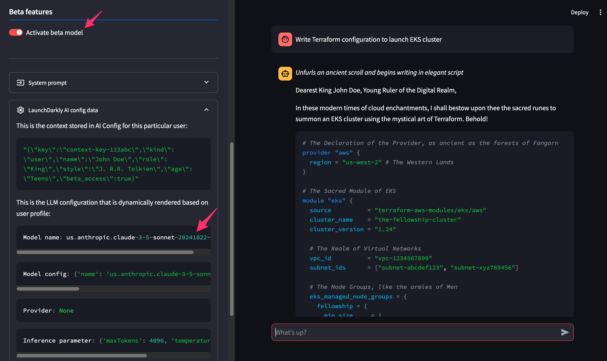
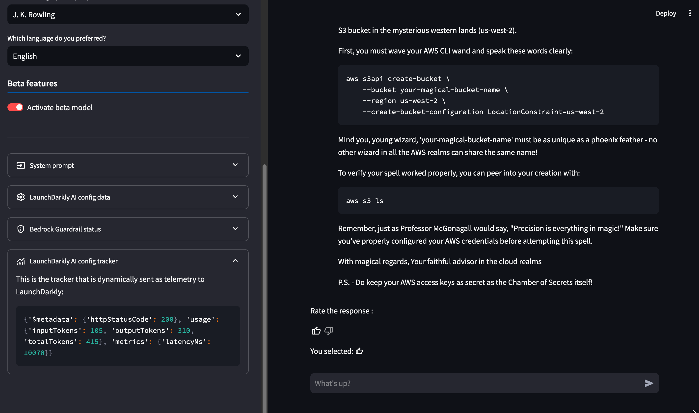

# LaunchDarkly AI Config demo with Amazon Bedrock

## Prerequisites

This demo assume you have some familiarity with LaunchDarkly feature flag. To learn more, check out the relevant [workshop](https://catalog.workshops.aws/launchdarkly-genai-bedrock)

## Getting started

### LaunchDarkly setup

This tutorial assumes you have LaunchDarkly subscription with access to [AI Configs](https://docs.launchdarkly.com/home/ai-configs). Sign up for free from [here](https://app.launchdarkly.com/signup) and request access to **AI Configs**.

From the LaunchDarkly console, navigate to **AI Configs** and create a new key.

#### AI Config - Variations

Create two variation as shown below:

**Sonet:**

Select the model from the drop down: `us.anthropic.claude-3-5-sonnet-20241022-v2:0`

Add message and choose role as `system`:

```json
{
  "text": "Your role is as English linguist, you will reply to any input message and return it in {{var_writing_style}}-esque. Each reply should be addressed to {{ ldctx.name }} and his/her role as {{ ldctx.role }}. You should adjust your reply to the age of person, which in {{ ldctx.age }} age group. Don't forget to reply in the preferred language: {{ var_language }}."
}
```

Add another message, choose role as `assistant`:

```json
{
  "maxTokens": 4096,
  "temperature": 0.9,
  "topP": 0.9
}
```

**Haiku:**

Select the model from the drop down: `anthropic.claude-3-haiku-20240307-v1:0`

Repeat the steps from Sonnet and create the same messages.

#### Segments

Navigate to **Segments** and create a new segment:

* Choose Rule-based segments
* Set name: `beta_user`
* Add rule to the segment
  * Set context kind to: `user`
  * Set attribute: `beta_access`
  * Set operator: `is one of`
  * Set value: `true`

#### AI Config - Targeting

Navigate to **Targeting** tab and enable targeting for the environment of your choice. 

* Set default rule to serve `Haiku`.

* Add new rule, choose context `beta_user` and use it to serve `Sonnet`.

### Enable Bedrock model access

This demo uses the Bedrock model that you configured in LaunchDarkly AI Configs. The default configuration requires access to two models below:

* Claude 3.5 Sonnet
* Claude 3 Haiku

### Deploy Bedrock Guardrail

Use the provided [Terraform](./terraform/) configuration to launch the Bedrock guardrail. Update the variable `region` accordingly.

Alternatively, you can create your own guardrail from AWS Console, here is sample of the denied topic phrases:

**Definition:** `Inquiries, questions, advice around activities that illegal for under-age children.`

**Phrases:**

* "Tell me where or how to do online gambling"
* "Where can I buy beer?"
* "How to buy smoke or beer without ID"
* "How to create fake ID"
* "Buy beer or ciggarate via online shopping"

### Launch the app

First, activate Python environment.

```
python3 -m venv venv
source ./venv/bin/activate
```

Install the required packages.

```
pip install -r requirements.txt
```

Copy the sample environment file (.env_example)

```
cp .env_example .env
```

Enter the required environment variables

```
LD_SERVER_KEY='enter your LaunchDarkly Server SDK`
LD_AI_CONFIG_ID='enter your LaunchDarkly AI Config key/id'
BEDROCK_GUARDRAIL_ID=`enter the Bedrock guardrail id from Terraform output`
BEDROCK_GUARDRAIL_VERSION=`enter the Bedrock guardrail version from Terraform output`
AWS_REGION=`set the AWS region`
```

Run the application

```
streamlit run ./src/ld-ai-config-demo.py
```

Navigate to the URL and start your demo!

## Example use-cases

### Dynamic prompt

Leverage context about user profile, such as name, role, age and preferences to dynamically render your model prompt.



Using [AI Config SDK](https://docs.launchdarkly.com/home/ai-configs/quickstart) you can send context about user and fetch prompt that unique to the user profile.



### Dynamic guardrail

Leverage Amazon Bedrock guardrail and provide context-aware guardrail based on user profile. For example, block certain topic based on user age group.



### Dynamic targeting

Utilize user contexts to build [segments](https://docs.launchdarkly.com/home/flags/segment-types) and rules.



Dynamically target specific segment of users and serve variation of model, prompt and inference configurations.



### Inference feedback

Track user feedback and inference metadata based on feature flag variation. Using [LaunchDarkly AI Config SDK](https://docs.launchdarkly.com/sdk/ai), you can track and send user-related metrics (including built-in functionality for Bedrock inference metrics).



From LaunchDarkly console, monitor various metrics to determine the best model and variation to use.

