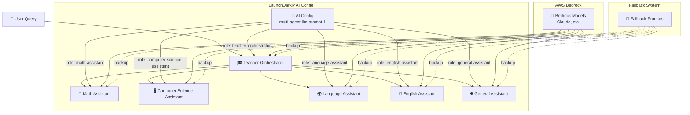
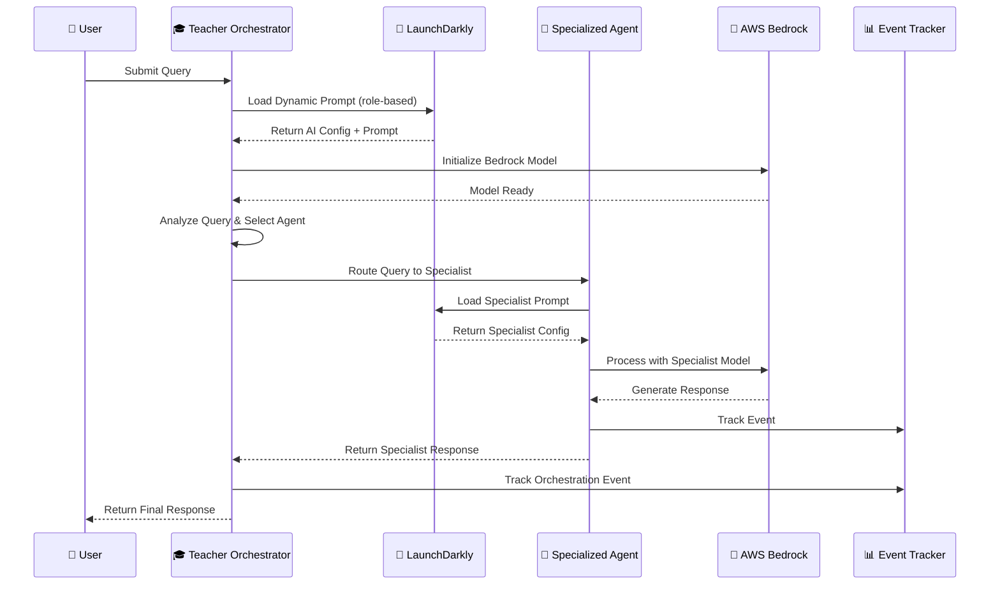
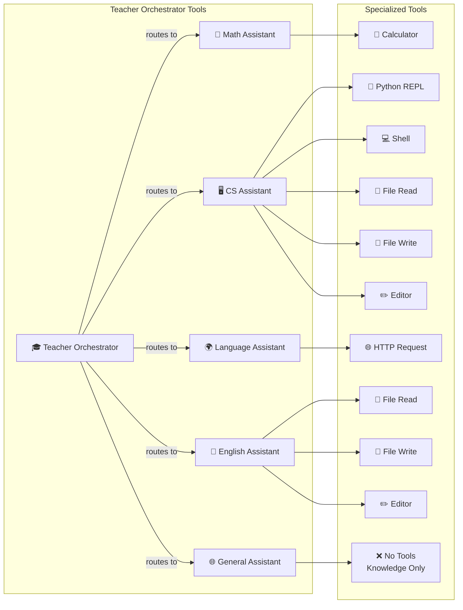
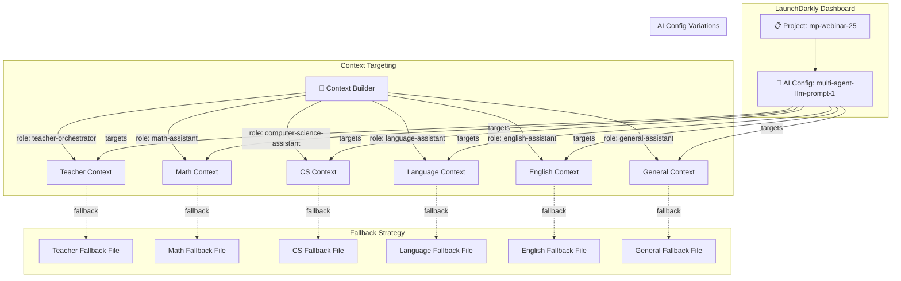
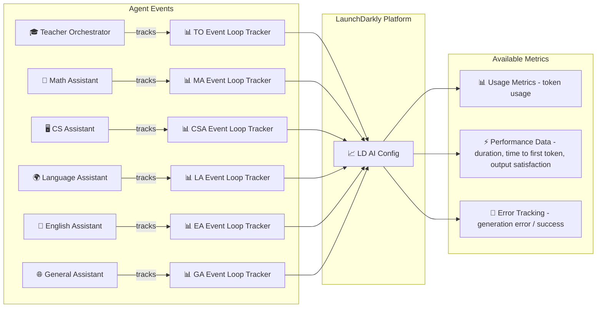
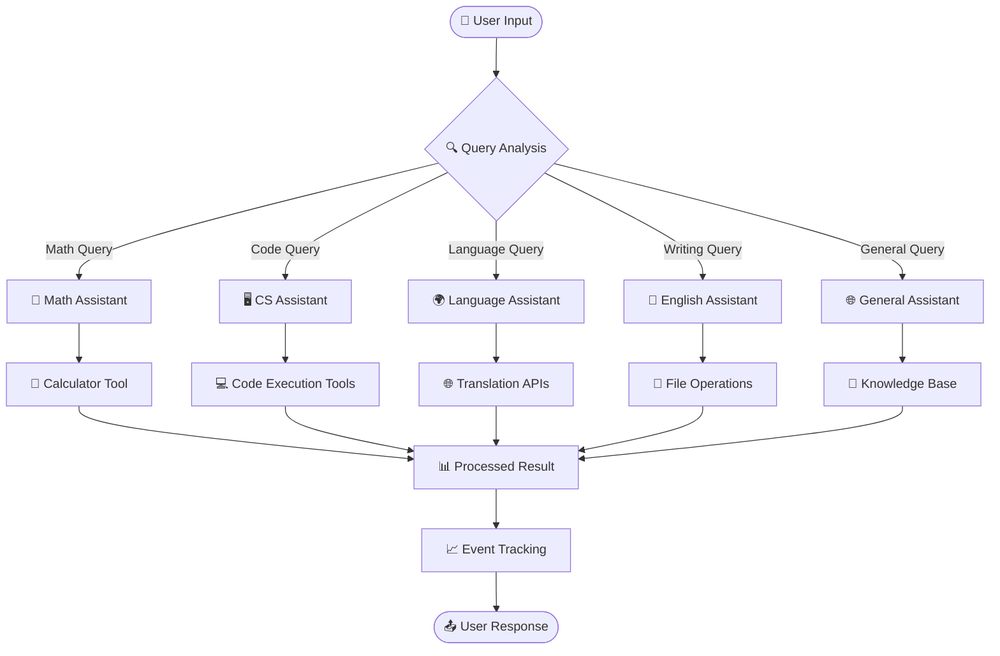
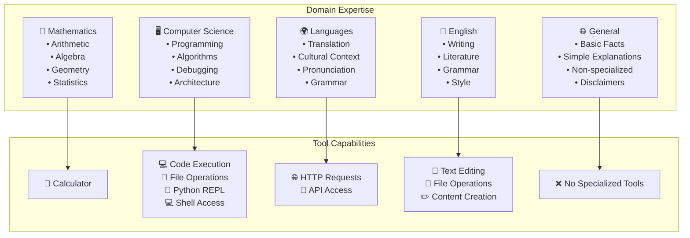

# Multi-Agent System Architecture Diagrams

This document provides various diagrams to illustrate the AI agent relationships and system architecture.

## 🏗️ **1. High-Level System Architecture**

## 🔄 **2. Agent Interaction Flow**

## 🛠️ **3. Tool Integration Architecture**

## 🔧 **4. LaunchDarkly Integration Architecture**

## 📊 **5. Event Tracking & Monitoring**

## 🏢 **6. Code Organization Structure**

```mermaid
graph TB
    ROOT[📁 strands-multi-agent/]
    
    ROOT --> TO[🎓 teacher_orchestrator.py]
    ROOT --> ENV[⚙️ .env]
    ROOT --> REQ[📋 requirements.txt]
    
    ROOT --> UTILS[📁 utils/]
    UTILS --> LDUTIL[🔧 ld_ai_config_utils.py]
    UTILS --> LOGUTIL[📊 logging_config.py]
    UTILS --> STRUTIL[🔄 strands_utils.py]
    
    ROOT --> AGENTS[📁 sub_agents/]
    AGENTS --> MA[🧮 math_assistant.py]
    AGENTS --> CSA[🖥️ computer_science_assistant.py]
    AGENTS --> LA[🌍 language_assistant.py]
    AGENTS --> EA[📝 english_assistant.py]
    AGENTS --> GA[🌐 general_assistant.py]
    
    ROOT --> FALLBACK[📁 fallback_prompts/]
    FALLBACK --> TFB[📄 teacher_orchestrator_fallback_prompt.txt]
    FALLBACK --> MFB[📄 math_assistant_fallback_prompt.txt]
    FALLBACK --> CSFB[📄 computer_science_assistant_fallback_prompt.txt]
    FALLBACK --> LAFB[📄 language_assistant_fallback_prompt.txt]
    FALLBACK --> EAFB[📄 english_assistant_fallback_prompt.txt]
    FALLBACK --> GAFB[📄 general_assistant_fallback_prompt.txt]
    
    ROOT --> DOCS[📁 docs/]
    DOCS --> ARCH[📄 architecture_diagrams.md]
```

## 🔄 **7. Data Flow Architecture**

## 🎯 **8. Agent Specialization Matrix**

---
