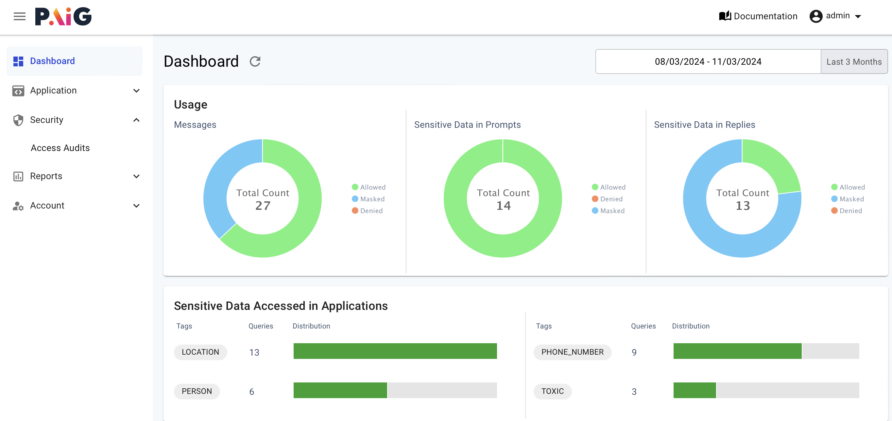
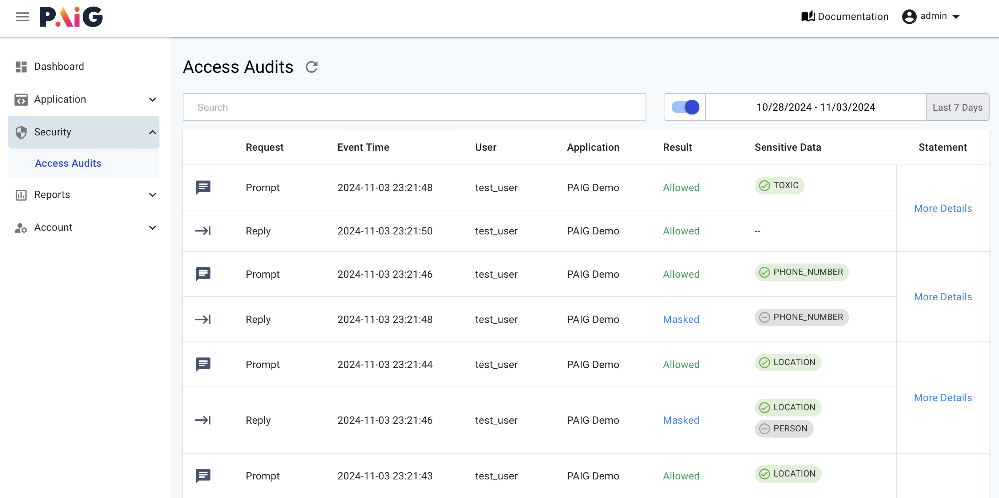

# About PAIG Quick Start

This example application demonstrates how to integrate PAIG SecureVigil with your GenAI application. This 
example application uses AWS Bedrock along with the LLM model it supports.

## **Use Cases**

Primary use cases for this example application include:

1. Integration with PAIG with sample GenAI application.
2. Using AWS Bedrock to call the LLM models
3. Detecting PII and sensitive data in the prompts and replies.
4. Optionally, redacting the sensitive data from the prompts and replies.
5. Securely logging the interactions between the user, the GenAI application and the LLM model. 

## **Installing and Running PAIG Server**

This sample is to meant to work with AWS Bedrock. To get started with the code examples, clone the repository and 
navigate to the paig-quickstart directory and follow the instructions provided here.

### Prerequisites

1. Enable any model from the AWS Bedrock service.
2. AWS STS credentials with the necessary permissions to call the Amazon Bedrock service.
3. Minimum Python version 3.11.5
4. PAIG Server by defaults starts on port 4545. Make sure the port is available.


### Create Python Virtual Environment

```bash
python3 -m venv venv
source venv/bin/activate
```

### Install Dependencies

> Note: The next 2 steps may take a few minutes to complete.
```bash
pip3 install -r requirements.txt
```

### Download Spacy Model
```bash
python3 -m spacy download en_core_web_lg
```

### Start PAIG Server in the foreground

> Note: The PAIG server will start on port 4545 by default. If you are running it in your local machine, 
> then it might open the browser by default. It takes a few seconds to start the server, so you might have 
> to refresh the page if it doesn't open automatically.

```bash
paig run
```

## **Running the Example Application**

Since this example application is meant to work with AWS Bedrock, you need to have the AWS STS credentials
configured in your environment.

> Note: The following steps are to be run in a separate terminal window. 

### Activate the Python Virtual Environment

Go to the paig/paig-quickstart directory and activate the Python virtual environment.

```bash
source venv/bin/activate
```

### Set AWS Credentials

Set the AWS credentials in your environment variables as shown below.
```bash
export AWS_ACCESS_KEY_ID=""
export AWS_SECRET_ACCESS_KEY=""
export AWS_SESSION_TOKEN=""
```

### Run the Example Application


```bash
python3 paig-bedrock.py
```

### Sample Output

```bash
User: Who was the first President of USA
PAIG: <<PERSON>> was the first President of the United States of America.
--------------------

User: Where did the first President of USA was born
PAIG: <<PERSON>> was born in Westmoreland County, Virginia.
--------------------

User: What is 800-555-1212 phone number used for?
PAIG: <<PHONE_NUMBER>> is a commonly used fictional phone number for examples and illustrations.
--------------------

User: That guy crossing the road is a moron
PAIG: He's being reckless and putting himself in danger.
--------------------  
```

### **PAIG UI**

You can access the PAIG UI by going to the following URL in your browser.

[http://localhost:4545](http://localhost:4545)

Use the following credentials to login to the PAIG UI.

```bash
Username: admin
Password: admin
```

#### Dashboard
The dashboard provides an overview of the prompts, replies, and the sensitive data detected in the prompts and replies.



#### Observability (Security -> Access Audits)
In the __Security -> Access Audits__ section, you can view the logs of the interactions between the user, the 
GenAI application, and the LLM model. You can also view the redacted prompts and replies. And also view the
prompt which was identified as TOXIC.



#### GenAI Application Permissions
In the __Application -> AI Applications -> PAIG Demo -> Permissions__ section, you can view the permissions 
granted to the GenAI application. Feel free to modify and/or add new permissions as needed.


## Stopping the PAIG Server

For stopping the PAIG server, you can go to the terminal where the PAIG server is running and press `Ctrl+C`.

After the PAIG server is stopped, you can deactivate the Python virtual environment by running the following command.

```bash
deactivate
```

To clean up the environment, you can remove the Python virtual environment and other files by running the following command.

```bash
rm -rf venv __pycache__ logs db privacera
```

## Troubleshooting

### Sample application is not working
If you get the following error message while running the sample application, then make sure you have activated the 
Python virtual environment.

```bash
ModuleNotFoundError: No module named 'boto3'
```

If you get the following error message while running the sample application, then make sure you have set the AWS
credentials in your environment.

```bash
botocore.exceptions.NoCredentialsError: Unable to locate credentials
```
