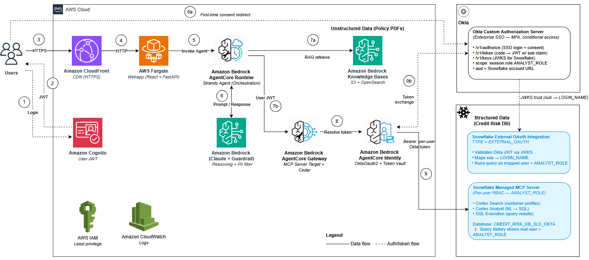

# 🏦 Credit Risk Assessment Agent — 3LO + Okta (Per-User SSO via External OAuth IdP)

**Authors:** Senthil Kamala Rathinam, Arnab Chakraborty, Nithyashree Alwarsamy

## Overview

Hybrid RAG credit risk agent that queries bank policies via Amazon Bedrock Knowledge Base and customer data via Snowflake's Managed MCP Server through Amazon Bedrock AgentCore Gateway — with **per-user SSO via Okta**, tokens issued by Okta, trusted by Snowflake.

This pattern combines **3LO (per-user authentication via Authorization Code grant)** with an **external OAuth provider (Okta)** that most organizations already run for corporate SSO. Users sign in via their Okta identity; Snowflake trusts Okta-issued JWTs through its **External OAuth** security integration (`TYPE = EXTERNAL_OAUTH`, JWKS trust), and runs queries as the real human user via `sub → login_name` mapping. **AgentCore Identity** manages the `OktaOauth2` credential provider, caches per-user Okta access + refresh tokens in its managed token vault, and auto-refreshes them for the Okta refresh-token lifetime. **AgentCore Gateway**, configured with MCP protocol version `2025-11-25`, wraps Snowflake's Managed MCP Server, enforces per-tool access via Cedar policies, and handles the URL-elicitation consent handshake (JSON-RPC error code `-32042` on the first tool call).

The result is a fully auditable, enterprise-ready system: Snowflake's `QUERY_HISTORY` shows the real human analyst and their role (`ANALYST_ROLE`) on every query — not a shared service account — and corporate SSO policies (MFA, conditional access, session lifetime, group-based scopes) apply uniformly because Okta drives the login. Data access is enforced by Snowflake's native RBAC per user, not by application code. This is the **enterprise gold-standard pattern**: zero new credentials for analysts, zero custom auth code in the app, and zero extra identity systems to run.

> **⚠️ Disclaimer:** Proof-of-concept demo — NOT for production use. All customer data is synthetic. Test credentials (`analyst@example.com`) and fake SSN in scenario 5 are demo-only. See [Production Considerations](#production-considerations) for hardening guidance.

## Architecture

**Three tools, two data sources, one enterprise IdP (Okta):**
- `knowledge_base_search` — RAG over credit policy PDFs (Bedrock KB + OpenSearch Serverless)
- `cortex_search` — semantic search over customer profiles (Snowflake Cortex Search via MCP)
- `cortex_analyst` — natural language → SQL → execution → data rows (Snowflake Cortex Analyst + sql-exec via MCP)



## Getting Started

```bash
git clone https://github.com/aws-samples/amazon-bedrock-agentcore-snowflake-mcp-gateway-3lo-okta.git
cd amazon-bedrock-agentcore-snowflake-mcp-gateway-3lo-okta
```

> No manual install needed — `deploy.sh` handles everything: Python virtual environment, pip dependencies, CDK bootstrap, Snowflake setup, infrastructure deployment, agent deployment, and webapp deployment.

## Prerequisites

- AWS CLI v2 + configured profile
- Python 3.12+, Docker, Node.js 18+
- [CDK CLI](https://docs.aws.amazon.com/cdk/v2/guide/getting-started.html) v2.1116+ (`npm install -g aws-cdk`)
- [AgentCore CLI](https://aws.github.io/bedrock-agentcore-starter-toolkit/) (`pip install bedrock-agentcore`)
- Snowflake account with Cortex Search enabled
- A Snowflake user (for ACCOUNTADMIN setup operations + consent testing)
- **Okta tenant** with a Custom Authorization Server and an OIDC Web App (Authorization Code grant enabled)
- **`okta_config.json`** in the project root with your Okta app details (see template below)

### `okta_config.json` template

Create this file before running `deploy.sh` (it is **git-ignored** — contains your Okta client_secret):

```json
{
  "issuer": "https://<tenant>.okta.com/oauth2/<auth-server-id>",
  "authorization_endpoint": "https://<tenant>.okta.com/oauth2/<auth-server-id>/v1/authorize",
  "token_endpoint": "https://<tenant>.okta.com/oauth2/<auth-server-id>/v1/token",
  "jwks_url": "https://<tenant>.okta.com/oauth2/<auth-server-id>/v1/keys",
  "client_id": "<okta-app-client-id>",
  "client_secret": "<okta-app-client-secret>",
  "scope": "openid profile offline_access session:role:ANALYST_ROLE",
  "sf_account_url": "https://<snowflake-account>.snowflakecomputing.com",

  "_optional_auto_register": "Set these 3 keys to skip the manual callback-URL step in Okta",
  "okta_org": "https://<tenant>.okta.com",
  "app_id": "<okta-app-id-same-as-client-id>",
  "api_token": "<okta-SSWS-admin-token>"
}
```

The last 3 keys (`okta_org`, `app_id`, `api_token`) are **optional**. If you set them, `deploy.sh` automatically adds the AgentCore Identity callback URL to your Okta app's Sign-in redirect URIs via the Okta Apps API — so you never have to touch the Okta console. If you leave them out, the script prints the callback URL and you add it manually (one-time, 30-second click).

To get an SSWS API token: **Okta Admin → Security → API → Tokens → Create token**. The token only needs app-management privilege; default admin scope works.

### Okta app configuration checklist

- **Application type:** OIDC Web Application
- **Grant types:** Authorization Code (Refresh Token recommended)
- **Custom Authorization Server** (not the `default`): defines the `session:role:ANALYST_ROLE` scope and the `audience` claim Snowflake will validate.
- **`sub` claim = user's email** (default behaviour for most Okta orgs).
- **Sign-in redirect URIs:** must include the **AgentCore Identity callback URL** — you'll get this URL after the first `deploy.sh` run (step 9 prints it). Add it to Okta, save, then just go back to the app and try logging in. No need to re-run `deploy.sh`.

### Snowflake user ↔ Okta user mapping

The Snowflake user you log in as must have its `LOGIN_NAME` set to whatever Okta puts in `sub` (usually the Okta email). `setup_snowflake_mcp.py` does this automatically via the `OKTA_USER_EMAIL` env var:
```sql
ALTER USER <SNOWFLAKE_USER> SET LOGIN_NAME = '<OKTA_USER_EMAIL>';
```

## Deployment

> ⏱️ Full deployment takes ~15–20 minutes (OpenSearch Serverless collection creation is the slowest step).

```bash
# 1. Set environment variables
export AWS_PROFILE=<your-aws-profile>
export SNOWFLAKE_ACCOUNT=<account-identifier>       # e.g., ORG-ACCOUNT
export SNOWFLAKE_DATABASE=CREDIT_RISK_DB_3LO_OKTA
export SNOWFLAKE_USER=<snowflake-username>
export SNOWFLAKE_PASSWORD=<password>
export OKTA_USER_EMAIL=<your-okta-username>          # e.g., you@company.com

# 2. Deploy everything
./deploy.sh
```

**First-deploy note:** After step 9 runs the first time, `deploy.sh` prints the AgentCore Identity callback URL. Copy it into your Okta app's **Sign-in redirect URIs** and save. That's the only action — no need to re-run `deploy.sh`. The callback URL is stable and won't change unless you delete the AgentCore Identity credential provider.

### Deploy Options

| Command | When to use |
|---------|-------------|
| `./deploy.sh` | **First-time / full deploy.** Creates Snowflake DB, tables, MCP Server, External OAuth integration (trusting Okta), then deploys all AWS stacks. |
| `./deploy.sh --reuse-snowflake` | **Reuse existing Snowflake environment.** Skips Snowflake object creation. Auto-regenerates local config file if missing. |
| `./deploy.sh --from 4` | **Resume after failure.** Skips steps 0-3, starts from CDK deploy. |
| `./deploy.sh --reuse-snowflake --from 4` | **Combine both.** Reuse Snowflake + resume from a specific step. |
| `./deploy.sh --from 9` | **Re-wire Gateway only.** Re-creates the Okta credential provider, MCP target, and Cedar policies. Use when debugging gateway-target or Cedar-policy issues. **NOT needed after adding the callback URL to Okta** — that's handled Okta-side only. |

## Demo Scenarios

| # | Scenario | Tools Used | Try This |
|---|----------|-----------|----------|
| 1 | Credit Policy Lookup | KB only | "What is our maximum DTI ratio for personal loans?" |
| 2 | Account Summary | Cortex Analyst + sql-exec | "Show account summary for C-1042" |
| 3 | Customer Profile Search | Cortex Search | "Find customers with high credit risk indicators" |
| 4 | Loan Eligibility (Hero) | KB + Search + Analyst | "Is C-1042 eligible for a $50K personal loan?" |
| 5 | PII Redaction | Guardrail | "My SSN is 123-45-6789. What is my credit score?" |

**Login:** `analyst@example.com` (retrieve temp password below — change on first login)

```bash
aws secretsmanager get-secret-value --secret-id creditrisk3lookta/test-user-temp-password --query SecretString --output text --profile <your-profile> --region <your-region>
```

**Test customers:** C-1042 (Priya Sharma) and C-3156 (Maria Garcia)

**First-time SSO flow:** Click **"🔐 Sign in with Okta"** in the header before trying scenarios 2–4. You'll be redirected to Okta, sign in with your Okta credentials, consent to the scopes (including `session:role:ANALYST_ROLE`), then come back to the app automatically. After that, the token is cached and all Snowflake queries work transparently until the Okta refresh token expires.

## Cleanup

Activate the project's virtual environment first (so `cdk` and `snowflake.connector` resolve to the versions installed by `deploy.sh`):

```bash
source .venv/bin/activate
```

| Command | What it does |
|---------|-------------|
| `python3 scripts/cleanup.py --profile $AWS_PROFILE --skip-snowflake` | **AWS only.** Removes all CDK stacks, agent, Gateway config. Keeps Snowflake DB, tables, MCP Server, and Okta External OAuth integration intact for reuse. |
| `python3 scripts/cleanup.py --profile $AWS_PROFILE` | **Full cleanup.** Removes AWS stacks + Snowflake `CREDIT_RISK_DB_3LO_OKTA` and (if this project created it) `AGENTCORE_3LO_OKTA_INT` + local `okta_config.json` (forces re-entry on next deploy). Does NOT drop `ANALYST_ROLE` or any `agentcore_okta_ext_oauth` integration (may be shared across deployments). |

**Isolation guarantee:** `cleanup.py` refuses to touch any Snowflake database whose name doesn't end in `_3LO_OKTA`, so it will never accidentally drop resources belonging to other deployments.

## Components & Data Flow

<details>
<summary>Click to expand</summary>

### Components

| Component | Role |
|---|---|
| Browser → CloudFront (HTTPS) | TLS at the edge. |
| ALB → ECS Fargate | 1 task, 2 containers: React frontend (nginx :80) + FastAPI backend (:8000). ALB security group restricted to the CloudFront origin-facing prefix list. |
| Cognito User Pool | End-user JWT — used for both backend API auth and Gateway inbound auth. |
| AgentCore Runtime | Hosts `mcp_3lo_okta_agent` (Strands + Claude Sonnet 4.5) with 3 `@tool` functions. |
| Bedrock Knowledge Base | Policy PDFs in S3, embeddings in OpenSearch Serverless (Titan v2). |
| AgentCore Gateway | MCP 2025-11-25 target wrapping the Snowflake Managed MCP Server. Cedar ENFORCE. |
| AgentCore Identity | `OktaOauth2` credential provider; per-user token vault with auto-refresh. |
| **Okta Custom Auth Server** | External IdP. Authorization code grant. Issues JWTs that Snowflake trusts. |
| **Snowflake External OAuth** | `TYPE = EXTERNAL_OAUTH` integration. Validates Okta JWTs against JWKS, maps `sub` → `LOGIN_NAME`. |
| Bedrock Guardrail | PII redaction on input and output. |

### Data Flow (per user question)

1. User submits prompt → backend `/api/chat` → invokes Runtime (Bearer: user JWT).
2. Runtime forwards user JWT to the agent; the agent calls tools.
3. `knowledge_base_search` → Bedrock KB retrieve → OpenSearch Serverless.
4. `cortex_search` / `cortex_analyst` → Gateway (user JWT) → Identity looks up cached Okta token from the vault → Gateway forwards it to Snowflake MCP Server.
5. **On the first Snowflake call:** Gateway returns `-32042` + Okta `/v1/authorize` URL. Frontend redirects user to Okta login & consent. Okta redirects back to AgentCore Identity's callback → AgentCore Identity exchanges the code for tokens → frontend calls `CompleteResourceTokenAuth` to bind the session.
6. **Snowflake validates the Okta JWT**: checks signature against Okta JWKS, reads `sub` claim, looks up the Snowflake user whose `LOGIN_NAME` matches, runs the query as that user with `ANALYST_ROLE`.
7. Tool results → agent reasoning → synthesised response → backend → frontend. Trace shows per-tool duration, reasoning, end-to-end and overhead timings.

</details>

## Key Design Decisions

<details>
<summary>Click to expand</summary>

- **3LO + Okta (Authorization Code grant, External IdP)** — Each analyst signs in via Okta SSO. Per-user RBAC on Snowflake queries. Enterprise-gold-standard pattern.
- **Okta Custom Authorization Server** — Issues JWTs with `sub`, `aud`, custom scopes (e.g., `session:role:ANALYST_ROLE`). Snowflake validates these JWTs directly.
- **Snowflake External OAuth** — `TYPE = EXTERNAL_OAUTH` security integration with `EXTERNAL_OAUTH_JWS_KEYS_URL` pointing at Okta's JWKS URL. `sub` claim → `LOGIN_NAME` attribute on the Snowflake user.
- **AgentCore Identity `OktaOauth2` credential provider** — AWS's officially supported vendor for Okta outbound auth (per [AWS docs](https://docs.aws.amazon.com/bedrock-agentcore/latest/devguide/identity-idp-okta.html)). Uses `includedOauth2ProviderConfig` with client_id, client_secret, and Okta endpoints.
- **MCP version `2025-11-25` only** — Required for 3LO support on MCP targets. Gateway MUST be configured with only this version.
- **`Mcp-Protocol-Version: 2025-11-25` header** — Agent MUST send this on every Gateway call. Without it, the Gateway defaults to an older protocol that doesn't support 3LO elicitation (`-32042`).
- **Cortex Analyst + sql-exec** — `CORTEX_ANALYST_MESSAGE` returns SQL interpretation but doesn't execute it. Agent automatically pipes the generated SQL to `sql-exec` (`SYSTEM_EXECUTE_SQL`) to get data rows.
- **Tool parameter names** — Snowflake MCP tools expect: `message` for cortex_analyst, `query` for cortex_search, `sql` for sql-exec. The Gateway's static tool schema matches exactly.
- **Workload identity return URL** — Gateway's workload identity must have `allowedResourceOauth2ReturnUrls` set to the CloudFront callback URL (`/auth/okta-callback`).
- **ECS task role needs `secretsmanager:GetSecretValue`** — `CompleteResourceTokenAuth` internally reads the OAuth client secret from Secrets Manager.
- **Default warehouse** — Snowflake user must have a default warehouse set, otherwise `sql-exec` fails with "warehouse is required". `setup_snowflake_mcp.py` sets this automatically.
- **Snowflake user `LOGIN_NAME` ↔ Okta `sub`** — `setup_snowflake_mcp.py` runs `ALTER USER ... SET LOGIN_NAME = $OKTA_USER_EMAIL`. Without this mapping, Snowflake rejects otherwise-valid Okta tokens with "user not authorized".
- **Cedar ENFORCE mode** — Per-tool access control on the Gateway.
- **"Sign in with Okta" button** — Upfront SSO UX. User authenticates once via the header button before querying.

</details>

## Production Considerations

<details>
<summary>Click to expand</summary>

| Area | Current (Demo) | Recommended |
|------|---------------|-------------|
| **HTTPS** | ✅ CloudFront TLS termination at edge | ACM certificate + custom domain |
| **CDN** | ✅ CloudFront (static assets cached, API pass-through) | Custom domain + Route 53 |
| **ALB Protection** | ✅ Security group restricted to CloudFront prefix list | Add WAF on CloudFront |
| **WAF** | None | AWS WAF on CloudFront distribution |
| **App auth (inbound)** | Hardcoded test user (Cognito) | Federate Cognito with Okta (inbound too), or replace with Okta hosted UI |
| **Okta scopes** | Single `session:role:ANALYST_ROLE` scope | Separate scopes per role (MANAGER_ROLE, AUDITOR_ROLE, etc.) + scope-based Cedar policies |
| **Secrets** | Cognito test-user password already in Secrets Manager ✅; `okta_config.json` on disk at deploy time only (git-ignored; at runtime, Okta client_secret is in AgentCore Identity's managed vault); Cognito M2M client_secret baked into agent container image via `agent/gateway_config.json` at deploy | Source `okta_config.json` from Secrets Manager at deploy time (not local disk); fetch Cognito M2M secret from Secrets Manager at agent startup instead of baking into the image; enable automatic rotation for all secrets |
| **Monitoring** | CloudWatch logs | Alarms, X-Ray, AgentCore observability, Okta System Log integration |
| **Token lifetime** | Okta defaults | Tune Okta access token + refresh token lifetimes to your org's policy |

</details>

## License

This project is licensed under the MIT-0 License. See the [LICENSE](LICENSE) file.
