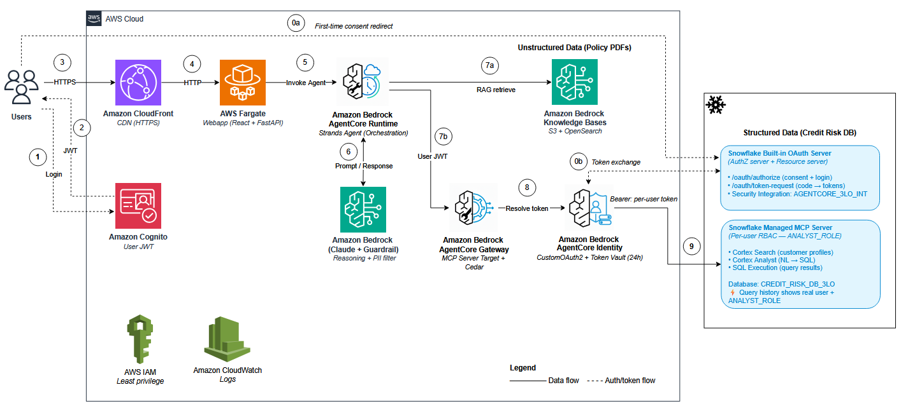

# 🏦 Credit Risk Assessment Agent — 3LO (Per-User Snowflake OAuth)

**Authors:** Senthil Kamala Rathinam, Arnab Chakraborty, Nithyashree Alwarsamy

## Overview

Hybrid RAG credit risk agent that queries bank policies via Amazon Bedrock Knowledge Base and customer data via Snowflake's Managed MCP Server through Amazon Bedrock AgentCore Gateway — with **per-user Snowflake authentication** via the OAuth 2.0 Authorization Code flow (3LO).

This pattern demonstrates **per-user data access without an external Identity Provider**. Instead of every request going to Snowflake under a single shared service account (the 2LO / `client_credentials` approach), each analyst signs into Snowflake with their own credentials through a browser consent flow. Snowflake acts as **both** the OAuth authorization server **and** the resource server — no Okta, Azure AD, or Auth0 required. **AgentCore Identity** manages the credential provider, caches per-user tokens in its token vault, and automatically refreshes them for ~24 hours. **AgentCore Gateway** wraps Snowflake's Managed MCP Server, enforces per-tool access via Cedar policies, and handles the URL-elicitation consent handshake (MCP protocol version `2025-11-25`).

The result is a fully auditable system: Snowflake's query history shows the real human user and role (`ANALYST_ROLE`) on every query, and data access is enforced by Snowflake's native RBAC per user — not by application code. This is the **simplest 3LO pattern to demonstrate** because it requires no external IdP, yet still delivers the per-user accountability regulated industries (banking, healthcare, finance) require.

> **⚠️ Disclaimer:** Proof-of-concept demo — NOT for production use. All customer data is synthetic. Test credentials (`analyst@example.com`) and fake SSN in scenario 5 are demo-only. See [Production Considerations](#production-considerations) for hardening guidance.

## Architecture

**Three tools, two data sources:**
- `knowledge_base_search` — RAG over credit policy PDFs (Bedrock KB + OpenSearch Serverless)
- `cortex_search` — semantic search over customer profiles (Snowflake Cortex Search via MCP)
- `cortex_analyst` — natural language → SQL → execution → data rows (Snowflake Cortex Analyst + sql-exec via MCP)



## Getting Started

```bash
git clone --depth 1 --no-checkout https://github.com/aws-samples/aws-generativeai-partner-samples
cd aws-generativeai-partner-samples/
git sparse-checkout set snowflake/amazon-bedrock-agentcore-snowflake-cortex-mcp/amazon-bedrock-agentcore-snowflake-mcp-gateway-3lo
git checkout
cd snowflake/amazon-bedrock-agentcore-snowflake-cortex-mcp/amazon-bedrock-agentcore-snowflake-mcp-gateway-3lo
```

> No manual install needed — `deploy.sh` handles everything: Python virtual environment, pip dependencies, CDK bootstrap, Snowflake setup, infrastructure deployment, agent deployment, and webapp deployment.

## Prerequisites

- AWS CLI v2 + configured profile
- Python 3.12+, Docker, Node.js 18+
- [CDK CLI](https://docs.aws.amazon.com/cdk/v2/guide/getting-started.html) v2.1116+ (`npm install -g aws-cdk`)
- [AgentCore CLI](https://aws.github.io/bedrock-agentcore-starter-toolkit/) (`pip install bedrock-agentcore`)
- Snowflake account with Cortex Search enabled
- Snowflake user account for 3LO consent (the user who will log in via browser)

## Deployment

> ⏱️ Full deployment takes ~15–20 minutes (OpenSearch Serverless collection creation is the slowest step).

```bash
# 1. Set environment variables
export AWS_PROFILE=<your-aws-profile>
export SNOWFLAKE_ACCOUNT=<account-identifier>       # e.g., ORG-ACCOUNT
export SNOWFLAKE_DATABASE=<database-name>            # e.g., CREDIT_RISK_DB_3LO
export SNOWFLAKE_USER=<username>                     # e.g., johndoe
export SNOWFLAKE_PASSWORD=<password>

# 2. Deploy everything
./deploy.sh
```

### Deploy Options

| Command | When to use |
|---------|-------------|
| `./deploy.sh` | **First-time / full deploy.** Creates Snowflake DB, tables, MCP Server, OAuth integration, then deploys all AWS stacks. |
| `./deploy.sh --reuse-snowflake` | **Reuse existing Snowflake environment.** Skips Snowflake object creation (step 3). Auto-regenerates local config files if missing. Use when deploying to a second AWS account that shares the same Snowflake DB. |
| `./deploy.sh --from 4` | **Resume after failure.** Skips steps 0-3, starts from CDK deploy. Use when Snowflake setup succeeded but AWS deployment failed. |
| `./deploy.sh --reuse-snowflake --from 4` | **Combine both.** Reuse Snowflake + resume from a specific step. |

## Demo Scenarios

| # | Scenario | Tools Used | Try This |
|---|----------|-----------|----------|
| 1 | Credit Policy Lookup | KB only | "What is our maximum DTI ratio for personal loans?" |
| 2 | Account Summary | Cortex Analyst + sql-exec | "Show account summary for C-1042" |
| 3 | Customer Profile Search | Cortex Search | "Find customers with high credit risk indicators" |
| 4 | Loan Eligibility (Hero) | KB + Search + Analyst | "Is C-1042 eligible for a $50K personal loan?" |
| 5 | PII Redaction | Guardrail | "My SSN is 123-45-6789. What is my credit score?" |

**Login:** `analyst@example.com` (retrieve temp password below — change on first login)

```bash
aws secretsmanager get-secret-value --secret-id creditrisk3lo/test-user-temp-password --query SecretString --output text --profile <your-profile> --region <your-region>
```

**Test customers:** C-1042 (Priya Sharma) and C-3156 (Maria Garcia)

**First time:** Click "❄️ Connect to Snowflake" in the header before trying scenarios 2-4. Log in with your Snowflake credentials and consent to ANALYST_ROLE. After that, all Snowflake queries work automatically for ~24 hours.

**Verify per-user tracking:** After running a few scenarios, run `python3 scripts/verify_3lo.py` to see your Snowflake `QUERY_HISTORY` with your personal username and `ANALYST_ROLE` on every query — proof that data access is enforced per user by Snowflake's native RBAC.

## Cleanup

Activate the project's virtual environment first (so `cdk` and `snowflake.connector` resolve to the versions installed by `deploy.sh`):

```bash
source .venv/bin/activate
```

| Command | What it does |
|---------|-------------|
| `python3 scripts/cleanup.py --profile $AWS_PROFILE --skip-snowflake` | **AWS only.** Removes all CDK stacks, agent, Gateway config. Keeps Snowflake DB, tables, MCP Server, and OAuth integration intact for reuse. |
| `python3 scripts/cleanup.py --profile $AWS_PROFILE` | **Full cleanup.** Removes everything — AWS stacks + Snowflake database, security integration, and ANALYST_ROLE. Use when you're done and want a clean slate. |

## Components & Data Flow

<details>
<summary>Click to expand</summary>

### Components

| Component | Role |
|---|---|
| Browser → CloudFront (HTTPS) | TLS at the edge. |
| ALB → ECS Fargate | 1 task, 2 containers: React frontend (nginx :80) + FastAPI backend (:8000). ALB security group restricted to the CloudFront origin-facing prefix list. |
| Cognito User Pool | End-user JWT — used for both backend API auth and Gateway inbound auth. |
| AgentCore Runtime | Hosts `mcp_3lo_agent` (Strands + Claude Sonnet 4.5) with 3 `@tool` functions. |
| Bedrock Knowledge Base | Policy PDFs in S3, embeddings in OpenSearch Serverless (Titan v2). |
| AgentCore Gateway | MCP 2025-11-25 target wrapping the Snowflake Managed MCP Server. Cedar ENFORCE for per-tool access. |
| AgentCore Identity | CustomOAuth2 credential provider; per-user token vault with ~24h refresh. |
| Snowflake built-in OAuth | `authorization_code` grant. No external IdP. |
| Bedrock Guardrail | PII redaction on input and output. |

### Data Flow (per user question)

1. User submits prompt → backend `/api/chat` → invokes Runtime (Bearer: user JWT).
2. Runtime forwards user JWT to the agent; the agent calls tools.
3. `knowledge_base_search` → Bedrock KB retrieve → OpenSearch Serverless.
4. `cortex_search` / `cortex_analyst` → Gateway (user JWT) → Identity resolves per-user Snowflake token from the vault → Snowflake MCP Server.
5. On the first Snowflake call: Gateway returns `-32042` + auth URL. Frontend redirects user to Snowflake login & consent. Callback → `CompleteResourceTokenAuth` caches tokens.
6. Tool results → agent reasoning → synthesised response → backend → frontend. Trace shows per-tool duration, reasoning, end-to-end and overhead timings.

</details>

## Key Design Decisions

<details>
<summary>Click to expand</summary>

- **3LO (Authorization Code grant)** — Each analyst authenticates with their own Snowflake credentials. Per-user RBAC, per-user audit trail.
- **Snowflake built-in OAuth** — Snowflake is its own authorization server. No external IdP (Okta) needed.
- **AgentCore Identity** — Manages the CustomOAuth2 credential provider, token vault, and automatic token refresh.
- **MCP version `2025-11-25` only** — Required for 3LO support. The Gateway MUST be configured with only this version. Using `2025-03-26` causes the Gateway to bypass the credential provider and call Snowflake without auth.
- **`Mcp-Protocol-Version: 2025-11-25` header** — The agent MUST send this header on every Gateway call. Without it, the Gateway defaults to an older protocol version that doesn't support 3LO elicitation (`-32042`).
- **Cortex Analyst + sql-exec** — Snowflake's `CORTEX_ANALYST_MESSAGE` tool returns SQL interpretation but doesn't execute it. The agent automatically pipes the generated SQL to the `sql-exec` (`SYSTEM_EXECUTE_SQL`) tool to get actual data rows.
- **Tool parameter names** — Snowflake MCP tools use specific parameter names: `message` for cortex_analyst, `query` for cortex_search, `sql` for sql-exec. The Gateway's static tool schema must match exactly.
- **Workload identity return URL** — The Gateway's workload identity must have `allowedResourceOauth2ReturnUrls` set to the CloudFront callback URL, otherwise `CompleteResourceTokenAuth` fails.
- **ECS task role needs `secretsmanager:GetSecretValue`** — `CompleteResourceTokenAuth` internally reads the OAuth client secret from Secrets Manager.
- **Default warehouse** — The Snowflake user must have a default warehouse set, otherwise `sql-exec` fails with "warehouse is required".
- **Cedar ENFORCE mode** — Per-tool access control on the Gateway.
- **"Connect to Snowflake" button** — Upfront auth UX. User authenticates once via the header button before querying. Avoids auth URLs appearing in chat responses.

</details>

## Production Considerations

<details>
<summary>Click to expand</summary>

| Area | Current (Demo) | Recommended |
|------|---------------|-------------|
| **HTTPS** | ✅ CloudFront TLS termination at edge | ACM certificate + custom domain |
| **CDN** | ✅ CloudFront (static assets cached, API pass-through) | Custom domain + Route 53 |
| **ALB Protection** | ✅ Security group restricted to CloudFront prefix list | Add WAF on CloudFront |
| **WAF** | None | AWS WAF on CloudFront distribution |
| **Auth** | Hardcoded test user (Cognito) | Cognito hosted UI or federated IdP |
| **Secrets** | Cognito test-user password already in Secrets Manager ✅; Snowflake OAuth client_secret in `snowflake_oauth_config.json` on disk at deploy time only (at runtime, held in AgentCore Identity's managed vault); Cognito M2M client_secret baked into agent container image via `agent/gateway_config.json` at deploy | Source deploy-time secrets from Secrets Manager (not local disk); fetch Cognito M2M secret from Secrets Manager at agent startup instead of baking into the image; enable automatic rotation for all secrets |
| **Monitoring** | CloudWatch logs | Alarms, X-Ray, AgentCore observability |
| **Token lifetime** | `OAUTH_REFRESH_TOKEN_VALIDITY = 86400` (24h) | Tune to match your organization's session policy — shorter lifetimes reduce token-compromise exposure |

</details>

## License

This project is licensed under the MIT-0 License. See the [LICENSE](LICENSE) file.
