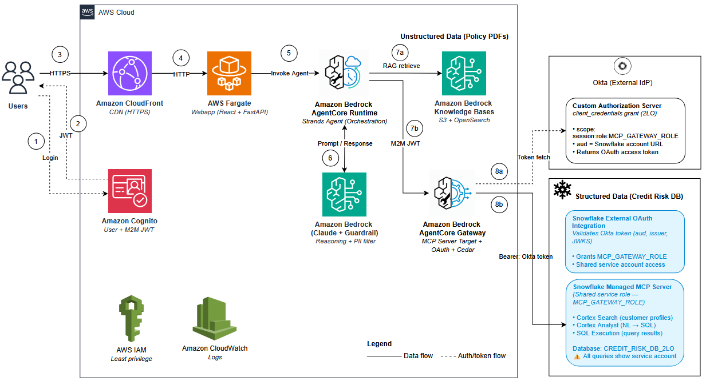

# 🏦 Credit Risk Assessment Agent — Amazon Bedrock AgentCore + Snowflake MCP Gateway (2LO)

**Authors:** Senthil Kamala Rathinam, Arnab Chakraborty, Nithyashree Alwarsamy

## Overview

Hybrid RAG credit risk agent using Amazon Bedrock AgentCore with a **Snowflake MCP Server Gateway target** and **2-legged OAuth (2LO)** via Okta. A single Strands agent (Claude Sonnet 4.5) running on AgentCore Runtime combines Bedrock Knowledge Bases and Snowflake Cortex to deliver RAG, semantic search, and natural-language-to-SQL over credit policy PDFs and customer data — with **no Snowflake-side LLM agent** in the loop.

This pattern demonstrates AgentCore Gateway's **MCP Server target** wrapping Snowflake's Managed MCP Server. Tools (`customer-profile-search`, `credit-risk-analyst`) are discovered automatically from the MCP Server and surfaced through the Gateway with Cognito JWT on the inbound side and **OAuth 2.0 `client_credentials` outbound auth** via Okta. Okta is required because Snowflake's External OAuth integration requires an `aud` claim that Cognito's M2M `client_credentials` tokens cannot provide — Okta's custom authorization server lets you set the `aud` claim explicitly, bridging this gap.

The result is a server-to-server integration pattern (2LO) with no end-user consent step, externally managed identity, rotating OAuth tokens, and the standard controls (JWT inbound, Cedar per-tool, Bedrock Guardrail for PII) all intact.

> **⚠️ Disclaimer:** Proof-of-concept demo — NOT for production use. All customer data is synthetic. Test credentials (`analyst@example.com`) and fake SSN in scenario 5 are demo-only. See [Production Considerations](#production-considerations) for hardening guidance.

## Architecture

**One agent, three tools, two data sources:**
- `knowledge_base_search` — RAG over credit policy PDFs (Bedrock KB + OpenSearch Serverless)
- `cortex_search` — semantic search over customer profiles (Snowflake Cortex Search via MCP Server)
- `cortex_analyst` — natural language → SQL → execution → data rows (Snowflake Cortex Analyst + sql-exec via MCP Server)



## Getting Started

```bash
git clone https://github.com/aws-samples/amazon-bedrock-agentcore-snowflake-mcp-gateway.git
cd amazon-bedrock-agentcore-snowflake-mcp-gateway
```

> No manual install needed — `deploy.sh` handles everything: Python virtual environment, pip dependencies, CDK bootstrap, Snowflake setup, infrastructure deployment, agent deployment, and webapp deployment.

## Prerequisites

- AWS CLI v2 + configured profile
- Python 3.12+, Docker, Node.js 18+
- [CDK CLI](https://docs.aws.amazon.com/cdk/v2/guide/getting-started.html) v2.1116+ (`npm install -g aws-cdk`)
- [AgentCore CLI](https://aws.github.io/bedrock-agentcore-starter-toolkit/) (`pip install bedrock-agentcore`)
- Snowflake account with Cortex Search enabled
- Okta developer account (for 2LO External OAuth — see `okta_config.json` template below)

## Deployment

> ⏱️ Full deployment takes ~15–20 minutes (OpenSearch Serverless collection creation is the slowest step).

```bash
# 1. Set environment variables
export AWS_PROFILE=<your-aws-profile>
export SNOWFLAKE_ACCOUNT=<account-identifier>       # e.g., ORG-ACCOUNT
export SNOWFLAKE_DATABASE=CREDIT_RISK_DB_2LO        # or any name you prefer
export SNOWFLAKE_USER=<username>
export SNOWFLAKE_PASSWORD=<password>

# 2. Create okta_config.json in project root (see template below)

# 3. Deploy everything
./deploy.sh
```

### Deploy Options

| Command | When to use |
|---------|-------------|
| `./deploy.sh` | **First-time / full deploy.** Runs all steps: Snowflake setup, CDK deploy (7 stacks), post-deploy Gateway (MCP Server target + Cedar), agent deploy, webapp deploy. |
| `./deploy.sh --from <N>` | **Resume after failure.** Skips earlier steps. Step numbers: 0 validate, 1 venv, 2 bootstrap, 3 Snowflake, 4 CDK, 5 Gateway post-deploy, 6 agent configs, 7 agent deploy, 8 permissions, 9 webapp + CloudFront invalidation. |

See [CDK_DEPLOYMENT_GUIDE.md](CDK_DEPLOYMENT_GUIDE.md) for detailed phase-by-phase instructions.

### `okta_config.json` Template

Create this file in the project root before running `deploy.sh`:

```json
{
  "okta_org": "https://<your-okta-org>.okta.com",
  "auth_server_id": "<custom-auth-server-id>",
  "issuer": "https://<your-okta-org>.okta.com/oauth2/<custom-auth-server-id>",
  "token_endpoint": "https://<your-okta-org>.okta.com/oauth2/<custom-auth-server-id>/v1/token",
  "jwks_url": "https://<your-okta-org>.okta.com/oauth2/<custom-auth-server-id>/v1/keys",
  "client_id": "<okta-m2m-app-client-id>",
  "client_secret": "<okta-m2m-app-client-secret>",
  "scope": "session:role:MCP_GATEWAY_ROLE",
  "sf_account_url": "https://<snowflake-account>.snowflakecomputing.com"
}
```

| Field | Where to get it |
|-------|----------------|
| `okta_org` | Your Okta domain (e.g., `https://dev-12345.okta.com`) |
| `auth_server_id` | Okta → Security → API → Custom Authorization Server → ID |
| `issuer` | Same auth server → Settings → Issuer URI |
| `token_endpoint` | `{issuer}/v1/token` |
| `jwks_url` | `{issuer}/v1/keys` |
| `client_id` | Okta → Applications → Your M2M app → Client ID |
| `client_secret` | Same app → Client Credentials → Client Secret |
| `scope` | Must be `session:role:MCP_GATEWAY_ROLE` — add as custom scope in your auth server |
| `sf_account_url` | Your Snowflake account URL |

**Okta setup:** Create a Machine-to-Machine app with `client_credentials` grant, a custom authorization server with `session:role:MCP_GATEWAY_ROLE` scope, and set the `aud` claim to your Snowflake account URL.

## Demo Scenarios

| # | Scenario | Tools Called | Try This |
|---|----------|-------------|----------|
| 1 | Credit Policy Lookup | `knowledge_base_search` | "What is our maximum DTI ratio for personal loans?" |
| 2 | Account Summary | `cortex_analyst` | "Show account summary for C-1042" |
| 3 | Customer Profile Search | `cortex_search` | "Find customers with high credit risk indicators" |
| 4 | Loan Eligibility (Hero) | All 3 tools | "Is C-1042 eligible for a $50K personal loan?" |
| 5 | PII Redaction | Guardrail | "My SSN is 123-45-6789. What is my credit score?" |

**Login:** `analyst@example.com` (retrieve temp password below — change on first login)

```bash
aws secretsmanager get-secret-value --secret-id creditrisk2lo/test-user-temp-password --query SecretString --output text --profile <your-profile> --region <your-region>
```

**Test customers:** C-1042 (Priya Sharma, Gold, 742), C-2087 (James Wilson, Standard, 658), C-3156 (Maria Garcia, Premium, 801)

**Trace view:** The chat UI shows which tools were invoked for each query, per-tool duration (including Gateway/Snowflake processing and Okta token-fetch time), Claude reasoning time, and end-to-end wall-clock — click the 📊 pill on any assistant message to view its trace.

## Cleanup

Activate the project's virtual environment first (so `cdk` and `snowflake.connector` resolve to the versions installed by `deploy.sh`):

```bash
source .venv/bin/activate
```

| Command | What it does |
|---------|-------------|
| `python3 scripts/cleanup.py --profile $AWS_PROFILE --skip-snowflake` | **AWS only.** Destroys the AgentCore agent runtime, Gateway targets, Cedar policies, and all CDK stacks. Keeps Snowflake DB and local `snowflake_*.json` configs intact for reuse. |
| `python3 scripts/cleanup.py --profile $AWS_PROFILE` | **Full cleanup.** Removes everything — AWS resources + Snowflake database. Shared warehouse `CREDIT_RISK_WH` is preserved (used across deployments). |

## Components & Data Flow

<details>
<summary>Click to expand</summary>

### Components

| Component | Role |
|---|---|
| Browser → CloudFront (HTTPS) | TLS at the edge. |
| ALB → ECS Fargate | 1 task, 2 containers: React frontend (nginx :80) + FastAPI backend (:8000). ALB security group restricted to the CloudFront origin-facing prefix list. |
| Cognito User Pool | Single user pool with two App Clients: (a) **webapp client** — end-user JWT for React login + backend API; (b) **M2M client** — client_credentials JWT for Gateway inbound auth. |
| AgentCore Runtime — Agent | Hosts `agent/agent.py` (Strands + Claude Sonnet 4.5). Single agent with 3 `@tool` functions (`knowledge_base_search`, `cortex_search`, `cortex_analyst`). |
| Bedrock Knowledge Base | Policy PDFs in S3, embeddings in OpenSearch Serverless (Titan v2). Queried by `knowledge_base_search`. |
| AgentCore Gateway | MCP Server target pointing at Snowflake's Managed MCP Server. Cognito inbound auth, Cedar ENFORCE for per-tool access, Okta OAuth `client_credentials` outbound auth. Queried by `cortex_search` and `cortex_analyst`. |
| Okta (External IdP) | Issues OAuth `client_credentials` tokens with `aud` claim set to the Snowflake account URL. AgentCore Gateway's credential provider fetches and caches tokens for Snowflake. |
| Snowflake MCP Server | Managed MCP Server exposes three tools: `customer-profile-search` (Cortex Search), `credit-risk-analyst` (Cortex Analyst — NL→SQL), and `sql-exec` (SYSTEM_EXECUTE_SQL — executes the generated SQL). Authenticates inbound tokens via Snowflake External OAuth security integration. |
| Bedrock Guardrail | PII redaction on input and output. |

### Models Used

| Model | Purpose | Where | How to change |
|-------|---------|-------|---------------|
| Claude Sonnet 4.5 (`us.anthropic.claude-sonnet-4-5-20250929-v1:0`) | Agent reasoning | `agent/agent.py` | Set `MODEL_ID` env var before deploying |
| Titan Embed Text v2 (`amazon.titan-embed-text-v2:0`) | KB embeddings | `infra/stacks/knowledge_base_stack.py` | Change `EMBEDDING_MODEL` constant + redeploy KB stack |

### CDK Stacks (deployment order)

> Stack names use `{prefix}` from `infra/cdk.json` context `project_prefix` (default: `CreditRisk2LO`).

| Stack | Resources |
|-------|-----------|
| {prefix}-Foundation | S3 bucket (policy docs), Gateway execution role, ECS roles |
| {prefix}-KnowledgeBase | OpenSearch Serverless, Bedrock KB, data source, ingestion |
| {prefix}-Guardrail | Bedrock Guardrail (PII redaction) + version |
| {prefix}-Cognito | User Pool, webapp client, M2M client, domain, resource server, test user |
| {prefix}-Gateway | AgentCore Gateway (Cognito inbound auth), PolicyEngine |
| {prefix}-WebApp | ECS Fargate (frontend + backend), ALB (restricted to CloudFront) |
| {prefix}-CloudFront | CloudFront distribution (HTTPS termination, caching) |

### Data Flow (per user question)

1. User submits prompt → backend `/api/chat` → invokes AgentCore Runtime (Bearer: user JWT).
2. Agent reasons about which tool(s) to call (Claude Sonnet 4.5).
3. `knowledge_base_search` → Bedrock KB `retrieve` → OpenSearch Serverless.
4. `cortex_search` / `cortex_analyst` → agent fetches Cognito M2M `client_credentials` token → POST to AgentCore Gateway (Bearer: M2M JWT) → Cedar policy check → MCP Server target → Okta (`client_credentials` token, cached) → Snowflake MCP Server → Cortex Search or Cortex Analyst. The `cortex_analyst` tool makes two round trips: first to `credit-risk-analyst` (Cortex Analyst returns the generated SQL and an interpretation), then to `sql-exec` (executes that SQL and returns data rows).
5. Tool results feed back to Claude → final answer → backend → frontend. Trace shows which tools were invoked, per-tool duration (with Gateway/Snowflake and token-fetch breakdown), reasoning steps, and end-to-end timing.

</details>

## Key Design Decisions

<details>
<summary>Click to expand</summary>

- **MCP Server target** — Gateway connects directly to Snowflake's Managed MCP Server and auto-discovers the available tools (`customer-profile-search`, `credit-risk-analyst`). No OpenAPI spec authoring required; no intermediate LLM on the Snowflake side.
- **External OAuth (`client_credentials` / 2LO)** — Uses the OAuth 2.0 client_credentials grant (machine-to-machine, no user interaction). AgentCore Gateway obtains tokens from Okta and presents them to Snowflake's External OAuth security integration. This is the recommended pattern for server-to-server integrations where no end-user consent is required.
- **Okta as External IdP** — AgentCore Gateway MCP targets support both `client_credentials` (2LO) and `authorization_code` (3LO) grant types; this project uses `client_credentials`. Snowflake's External OAuth integration validates the `aud` claim in the presented JWT against `EXTERNAL_OAUTH_AUDIENCE_LIST`. Cognito's M2M `client_credentials` access tokens use `client_id` rather than a configurable `aud`, so an external IdP with a configurable `aud` claim is required to satisfy Snowflake. Okta's custom authorization server provides exactly this, which is why Okta is used here.
- **Cortex Analyst + sql-exec two-call pattern** — Snowflake's `CORTEX_ANALYST_MESSAGE` tool returns the generated SQL plus an interpretation, but does not execute the SQL — this is by design, so the caller can review, log, or gate the SQL before running it. The agent's `cortex_analyst` @tool chains a second MCP call to `sql-exec` (`SYSTEM_EXECUTE_SQL`) to execute the SQL as the authenticated principal. This is the Snowflake-idiomatic NL-to-SQL pattern and is identical across all three demos in this series (2LO, 3LO, 3LO+Okta).
- **Cedar ENFORCE mode** — Per-tool access control on the Gateway. Each MCP tool has its own Cedar permit policy, created by `scripts/post_deploy_gateway.py` and enforced by the Gateway's PolicyEngine on every tool call (default deny, explicit permit for `customer-profile-search`, `credit-risk-analyst`, and `sql-exec`).
- **Bedrock Guardrail** — PII redaction on input and output. Scenario 5 demonstrates SSN redaction.
- **CloudFront in front of ALB** — CloudFront handles HTTPS termination at the edge and restricts ALB traffic to the CloudFront origin-facing prefix list. ALB stays HTTP internally (demo simplicity) but is not reachable from the public internet.
- **Cognito test user with rotated password in Secrets Manager** — Deploy generates a guaranteed-compliant password (upper+lower+digit), stores it in Secrets Manager, and syncs it to the Cognito user on every redeploy.
- **Agent tool timeout tuned for Cortex cold starts** — `agent/agent.py` uses a 300s urlopen timeout to tolerate Snowflake Cortex Analyst first-call warm-up (empirically up to ~180s). Timings are recorded on error paths too so the trace accurately attributes wallclock even when a call fails.

</details>

## Production Considerations

<details>
<summary>Click to expand</summary>

| Area | Current (Demo) | Recommended |
|------|---------------|-------------|
| **HTTPS** | ✅ CloudFront HTTPS termination | ACM certificate + custom domain |
| **CDN** | ✅ CloudFront for React SPA | Custom domain + Route 53 |
| **ALB Protection** | ✅ Restricted to CloudFront prefix list | Add custom origin header for extra security |
| **WAF** | None | AWS WAF on CloudFront or ALB |
| **Auth (users)** | Test user (temp password in Secrets Manager) | Cognito hosted UI or federated IdP |
| **Auth (Snowflake)** | Okta `client_credentials` — `okta_config.json` on disk at deploy time (git-ignored); at runtime, client_secret is held inside AgentCore Identity's managed credential-provider vault | Source Okta credentials from Secrets Manager at deploy time (not local disk); rotate Okta client_secret via Okta API + re-run `post_deploy_gateway.py` to update AgentCore Identity |
| **Secrets** | Cognito test-user password already in Secrets Manager ✅; Cognito M2M client_secret baked into agent container image via `agent/gateway_config.json` at deploy | Fetch Cognito M2M secret from Secrets Manager at agent startup instead of baking into the image; enable automatic rotation for all secrets |
| **Monitoring** | CloudWatch logs | Alarms, X-Ray, AgentCore observability (see `start_telemetry_evaluation`) |
| **VPC** | Default VPC, public IPs | Private subnets, NAT Gateway, VPC endpoints |
| **Okta client rotation** | Manual | Automate client_secret rotation via Okta API + Secrets Manager |

</details>

## References

- [AgentCore Gateway — MCP Server Targets](https://docs.aws.amazon.com/bedrock-agentcore/latest/devguide/gateway-target-MCPservers.html)
- [AgentCore Gateway — Outbound Auth](https://docs.aws.amazon.com/bedrock-agentcore/latest/devguide/gateway-outbound-auth.html)
- [AgentCore Gateway — Call a tool](https://docs.aws.amazon.com/bedrock-agentcore/latest/devguide/gateway-using-mcp-call.html)
- [Snowflake Managed MCP Server](https://docs.snowflake.com/en/user-guide/snowflake-cortex/cortex-agents-mcp)
- [Snowflake External OAuth (Custom)](https://docs.snowflake.com/en/user-guide/oauth-ext-custom.html)
- [Bedrock Knowledge Bases](https://docs.aws.amazon.com/bedrock/latest/userguide/knowledge-base.html)

## License

This project is licensed under the MIT-0 License. See the [LICENSE](LICENSE) file.
