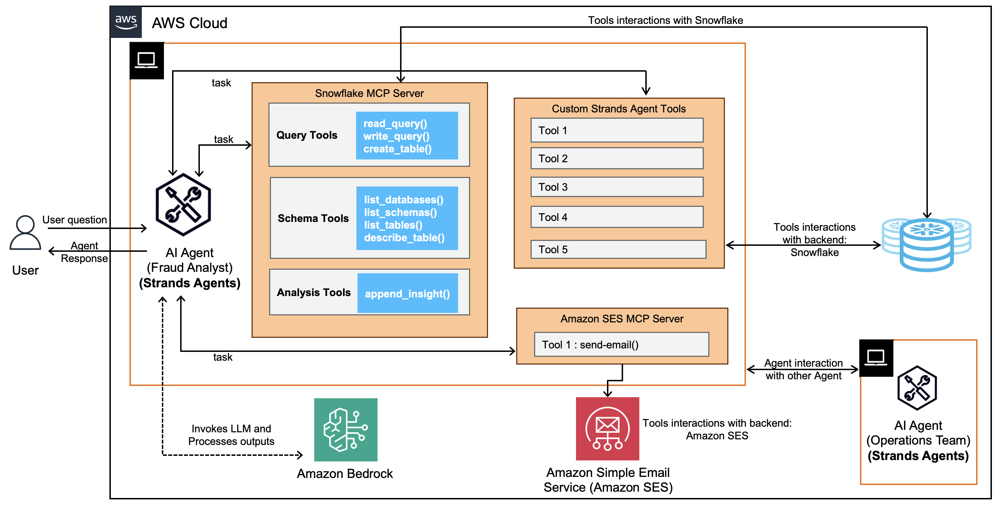

# Amazon Bedrock with Snowflake - Agentic workflows with Snowflake MCP Server Demo

## Fraud Analytics Expert application powered by Amazon Bedrock and Snowflake MCP Server

## Overview
The application provides intelligent real-time analysis on Fraudulent Financial Transactions leveraging:
- Amazon's opensource Strands SDK based Agentic AI application
- Amazon Bedrock's Claude 3.x Sonnet for natural language understanding and reasoning
- MCP Server with tools to connect and query Snowflake
- Snowflake for efficient data querying and analytics

## Reference Architecture

### Agentic AI with Amazon Open Source Strands SDK and Snowflake
[]

## Setup

### Set Up Python Environment & install Python dependencies

```bash
# install uv
cd aws-generativeai-partner-samples/snowflake/mcp/fraud-analysis-mcp-implementation
curl -LsSf https://astral.sh/uv/install.sh | sh

# Create a new environment
uv venv snowflake-mcp-implementation-env

# Activate the environment
source snowflake-mcp-implementation-env/bin/activate  # On Unix/Mac
# or
.\elastic-mcp-official-env\Scripts\activate   # On Windows

# Install required packages
uv pip install -r requirements.txt
```

### Set Up Environment Variables

Run the script environment_variables_setup.sh to setup .env file with the following credentials:

- Snowflake credentials
- AWS credentials (for Bedrock access)
- Make the script executable by adding execute permissions:

```bash
chmod +x environment_variables_setup.sh
./environment_variables_setup.sh
```

### Setup MCP Servers
Currently we are using Custom Snowflake MCP Server pre-packaged in the mcp-servers\mcp-snowflake-server folder.

## Running the Application

Go ahead and run the application. You are supplying the Snowflake MCP server path as an argument.

In terminal 1 run:
```bash
python mcp-servers/mcp-snowflake-server/src/mcp_snowflake_server/server_run.py
```

In terminal 2 run:
```bash
streamlit run mcp-clients/fraud_analytics_streamlit.py
```
streamlit run snowflake/mcp/fraud-analysis-mcp-implementation/mcp-clients/fraud_analytics_streamlit.py

Sample Queries to ask
- you are an analyst detecting fraud transactions based on data in tables in Snowflake database workshop_db. Can you list fradulent transactions?
- Can you generate detailed comprehensive report on fraudulent transactions?
- can you generate a report of these frudulent transactions and send email to the operations team
- how many records or transaction seem fraudulent?
- can you list all the detected fraudulent transactions

- Can you list fradulent transactions?
- Can you generate detailed comprehensive report on fraudulent transactions?
- can you generate a report of these frudulent transactions and send email to the operations team at email address nidhigva@amazon.com

## Conclusion

This project demonstrates how to create MCP-compliant servers for data retrieval and integrate them with foundation models to provide seamless responses to complex queries that span multiple domains of information.

### Amazon Bedrock
- Powerful natural language understanding with FMs from Anthropic via Amazon Bedrock
- No ML infrastructure management required
- Pay-per-use pricing model
- Enhanced reasoning capabilities for complex queries