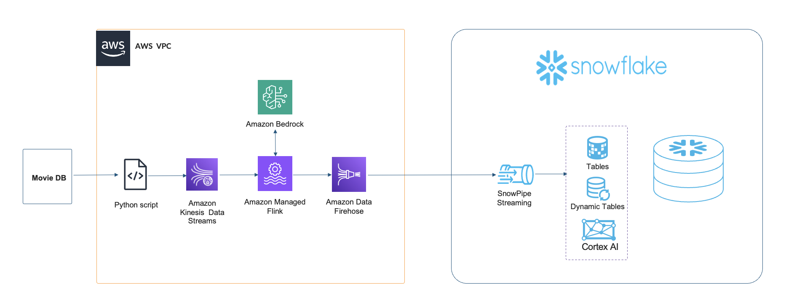

# Streaming Generative AI Application on AWS

## Overview 

This repository contains the code to show how to easily incorporate generative AI into a real-time streaming pipeline. More specifically, the Flink application utilizes Flink's Async I/O API to make asynchronous calls to Amazon Bedrock's Claude 3 Haiku model, allowing for efficient processing without blocking the main data flow. This asynchronous pattern ensures the pipeline maintains high throughput while still benefiting from AI-powered analysis.

This repository is intended to get developers started experimenting with generative AI and streaming data on AWS.

## Architecture Diagram 



The architecture diagram depicts the real-time streaming pipeline. The data journey begins with a Python-based producer that simulates streaming by sending movie reviews from the Large Movie Review Dataset to an Amazon Kinesis Data Stream. This stream serves as the entry point for real-time data processing. From there, an Amazon Managed Service for Apache Flink application consumes the streaming data and performs the core processing logic.

After processing, the Flink application directs the enriched data to Amazon Kinesis Data Firehose, which serves as a reliable delivery stream to the final destination as Snowflake. Firehose handles the buffering, batching, and reliable delivery of the processed reviews to Snowflake. This architecture choice simplifies the delivery mechanism and provides built-in resilience for the data pipeline.

The final component demonstrates an advanced implementation of real-time data processing combined with AI-powered content generation in Snowflake. We create a dynamic table to continuously join movie reviews with their corresponding movie information. This ensures that the data remains current and synchronized. Then we use Snowflake's Cortex feature with the Claude-3-Sonnet model to enhance the movie data with AI-generated content. The integration of dynamic tables with AI capabilities demonstrates a modern approach to real-time data enrichment and analysis.

## Pre-requisites
* [An AWS account](https://console.aws.amazon.com/console/home?nc2=h_ct&src=header-signin)
* [Java 11 or later](https://docs.aws.amazon.com/corretto/latest/corretto-11-ug/downloads-list.html)
* [Apache Maven 3.9.6 or later](https://maven.apache.org/)
* [AWS CLI](https://docs.aws.amazon.com/cli/latest/userguide/getting-started-install.html) 
* [AWS Cloud Development Kit (CDK)](https://aws.amazon.com/cdk/)
* [Python 3.9 or later](https://www.python.org/downloads/)
* Model access to Anthropic's Claude 3 Haiku model. For setup instructions, refer to [Add model access](https://docs.aws.amazon.com/bedrock/latest/userguide/model-access.html) in the documentation of Amazon Bedrock.
* [Large Movie Review Dataset](https://ai.stanford.edu/~amaas/data/sentiment/)

    *Andrew L. Maas, Raymond E. Daly, Peter T. Pham, Dan Huang, Andrew Y. Ng, and Christopher Potts. (2011). [Learning Word Vectors for Sentiment Analysis](https://ai.stanford.edu/~amaas/papers/wvSent_acl2011.pdf). The 49th Annual Meeting of the Association for Computational Linguistics (ACL 2011)*

## Getting Started

1. Clone the repository to your desired workspace:

```bash
git clone https://github.com/aws-samples/aws-generativeai-partner-samples.git
```

2. Move to the flink-async-bedrock directory and build the JAR file:

```bash
cd flink-async-bedrock && mvn clean package
```

3. Afterwards move back to the root of the directory, and then to the cdk directory to deploy the resources in your AWS account. *Note that you have configured the AWS CLI before with your credentials (for more info see [here](https://docs.aws.amazon.com/cli/latest/userguide/cli-chap-configure.html)).*

```bash
cd cdk && npm install & cdk deploy
```

4. Take note of the output values. The output will similar to the output below:

```bash
 ✅  StreamingGenerativeAIStack

✨  Deployment time: 1414.26s
```

5. Download the review data [here](https://ai.stanford.edu/~amaas/data/sentiment/).
6. After the download is complete, extract the `.tar.gz` file to retrieve the folder named `aclImdb 3` or similar that contains the review data. Rename the review data folder to `aclImdb`.
7. Move the extracted folder inside the `data/` directory within the downloaded repository.

8. Modify the `DATA_DIR` path in `producer/produce.py` as required. Be sure to also adapt the `AWS_REGION` constant if you are deploying this in a region other than `us-west-2`.

10. Install the required dependencies and start generating data:

```bash
cd producer 
pip install -r requirements.txt
python produce.py
``` 

11. Verify that data is flowing through the pipeline and being delivered to your Amazon Data Firehose and to its destination Snowflake.

## Clean up 

Delete the StreamingGenerativeAI-Stack in your AWS account.

```bash
cd cdk && cdk destroy
```

## Security

See [CONTRIBUTING](CONTRIBUTING.md#security-issue-notifications) for more information.

## License

This library is licensed under the MIT-0 License. See the LICENSE file. 

## Authors

- [Frank Dallezotte](https://github.com/frank-aws)
- Original Partner Solution - https://github.com/aws-samples/aws-streaming-generative-ai-application
