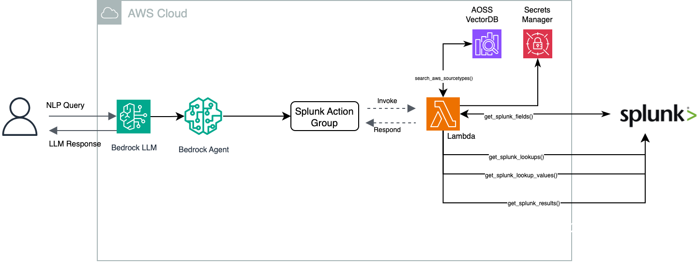

# Splunk Bedrock Integration Suite

## An Agentic AI approach to build customized Splunk assistants using Bedrock agents
This solution provides an approach to build an AI assistant for your Splunk environment, using Amazon BedRock LLMs and features. This AI assistant takes natural language input and translates it into executable Splunk SPL query, executes the query, analyze the results and provide you the summary of findings.


## Components
This project consists of three components:

1. Jupyter notebooks for solution walk through and understanding the implementation:
   1. `Splunk_secrets.ipynb` - Run this notebook to create and store secrets for Splunk User Token and Host information
   2. `Splunk_bedrock_agent.ipynb` - Run this notebook for step by step instructions on creating VectorDB for source types, lambda functions, bedrock agents, invocation and clean-up instructions.   
2. A CDK application that deploys an AWS Bedrock agent integrated with Splunk.
3. A Streamlit-based demo application showcasing Bedrock capabilities.

Choose the appropriate component based on your needs.

## Architecture Overview




The solution consists of the following main components:

- Amazon Bedrock Agent for handling queries
- Amazon OpenSearch Serverless for data storage and search
- AWS Lambda functions for data ingestion and querying
- Integration with Splunk for data sourcing
- Amazon S3 for storing intermediate data

## Components

### 1. CDK Deployment (Infrastructure)
This component sets up the core infrastructure including the Bedrock agent, OpenSearch, and Lambda functions.

### 2. Streamlit Demo Application
Located in the `/streamlitapp` directory, this component provides a web-based interface for interacting with Bedrock models.

## Prerequisites

Before using this solution, you need:

1. AWS Account with appropriate permissions
2. Python 3.8 or later
3. AWS Bedrock access enabled in your account
4. Splunk instance with appropriate access

Additional requirements per component:
- For CDK Deployment: AWS CDK CLI installed. Refer [AWS documentation](https://docs.aws.amazon.com/cdk/v2/guide/getting_started.html) for CDK


## Getting Started

1. Clone this repository

2. Set up your environment:

### Environment Setup

1. Create a virtual environment:
   ```bash
   python3 -m venv .venv
   ```

2. Activate the virtual environment:
   - On macOS/Linux:
     ```bash
     source .venv/bin/activate
     ```
   - On Windows:
     ```bash
     .venv\Scripts\activate
     ```

3. Install dependencies within the virtual environment:
   ```bash
   pip install -r requirements.txt
   ```
   
### Environment Variables

Before proceeding, set the following environment variables:

- AWS_ACCOUNT_ID
- S3_BUCKET_NAME (optional)
- SPLUNK_SECRET_NAME

3. Choose your component:

### For CDK Deployment:

1. Install CDK dependencies:
```bash
   cd stacks
   pip install -r requirements.txt
```
2. Edit `create_splunk_secrets.py` and update the SplunkHost and SplunkToken and run this python script to create the Splunk secrets in AWS Secrets Manager. Note down the sercets ARN for following stept configure environment variables.
```bash
python create_splunk_secrets.py
```
3. Bootstrap CDK (if not already done):
   
`cdk bootstrap aws://ACCOUNT-NUMBER/REGION`

4. Configure environment variables:
```bash
export AWS_ACCOUNT_ID=your_account_id
export S3_BUCKET_NAME=your_bucket_name  # defaults to splunkrag{account_id}
export SPLUNK_SECRET_NAME=your_secret_name  # ARN format created from previous step
```

5. Update configuration in `stacks/config.py`:
   - Verify ACCOUNT_REGION (default: us-east-1)
   - Adjust RAG_PROJ_NAME (default: e2e-rag)

6. Deploy the stacks
   ```bash
      cdk deploy --all
   ```

7. Clean up (optional)
   ```bash
      cdk destroy --all
   ```

### For Streamlit Demo:
Capture the following outputs from BedrockAgentStack and replace them in the `.env` in the streamlitapp directory

For example, if your CDK output is shown as below:
```
   BedrockAgentStack.BedrockAgentAlias = 7D5OBAYQUT|R4KHCSUTXD
   BedrockAgentStack.BedrockAgentID = 7D5OBAYQUT
```

Then edit your `.env` file as below:
```
# Environment variables for streamlit app
# Replace AGENT_ID and AGENT_ALIAS_ID
LOG_LEVEL=INFO
BEDROCK_AGENT_ID=7D5OBAYQUT
BEDROCK_AGENT_ALIAS_ID=R4KHCSUTXD
```

You can also retrieve the alias and agent Id from Bedrock Agent console

Follow the setup instructions in `streamlitapp/README.md`

The Streamlit app will be available at:
- Local: http://localhost:8501


## Stack Components

The solution deploys these CDK stacks:

### 1. KbRoleStack
- Creates IAM roles for knowledge base access
- Role name format: {RAG_PROJ_NAME}-kb-role

### 2. OpenSearchServerlessInfraStack
- Sets up OpenSearch Serverless collection and indexes
- Collection name: {RAG_PROJ_NAME}-kb-collection
- Index name: splunk-sourcetypes

### 3. KnowledgeBaseStack
- Configures Bedrock knowledge base integration
- Sets up data source connections
- Deploys ingestion and query Lambda functions
- Configures EventBridge rules for synchronization

### 4. BedrockStack
- Configures Bedrock agent and execution role
- Integrates with knowledge base
- Sets up Splunk connection configuration


## Configuration Details

The solution uses these key configurations:

1. Embedding Model:
   - Default: amazon.titan-embed-text-v2:0

2. OpenSearch Settings:
   - Collection: {RAG_PROJ_NAME}-kb-collection
   - Index: splunk-sourcetypes

3. Splunk Integration:
   - Uses Secrets Manager for credentials
   - Default secret ARN format:
     arn:aws:secretsmanager:{region}:{account_id}:secret:splunk-bedrock-secret-bPya16

4. S3 Storage:
   - Default bucket name: splunkrag{account_id}
   - Can be overridden via environment variable

## Troubleshooting

1. Check CloudWatch logs for Lambda functions:
   - Ingestion Lambda
   - Query Lambda

2. Verify environment variables:
   - AWS_ACCOUNT_ID
   - S3_BUCKET_NAME
   - SPLUNK_SECRET_NAME

3. Common Issues:
   - Ensure AWS Bedrock service access is enabled
   - Verify Splunk credentials in Secrets Manager
   - Check IAM roles and permissions

## Security Considerations

- Uses IAM roles with least privilege
- Secrets stored in AWS Secrets Manager
- Network access restricted by VPC configuration
- Logging and monitoring through CloudWatch
- Encryption at rest for all data stores
- Secure API endpoints for all services
- Encrypted data transfer and storage


### CDK Deployment Testing
1. Access the AWS Console and navigate to the Bedrock Agents
2. Verify the agent status is "Available"
3. Test the agent through the AWS Console test interface


## Maintenance and Updates

1. Regular Updates
   - Check for CDK package updates
   - Review AWS Bedrock model versions
   - Update Python dependencies

2. Monitoring
   - Configure CloudWatch alarms
   - Monitor usage metrics
   - Check application logs

3. Cost Management
   - Monitor OpenSearch usage
   - Track Bedrock API calls
   - Review Lambda invocations

## Support and Contact

For issues and questions:
1. Check the troubleshooting section
2. Review CloudWatch logs
3. Open a GitHub issue for bugs
4. Contact AWS Support for service-specific issues


## Contributing

Contributions are welcome! Please submit pull requests with improvements.

## License

This library is licensed under the MIT-0 License. See the LICENSE file.
